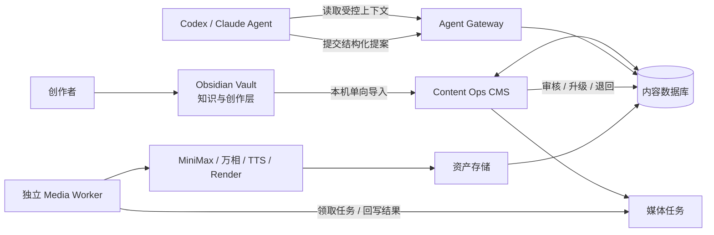

# AI 内容生产系统 PRD（V1）

> 2026-10-06 决策更新：在线创作以平台云端存储为主，Obsidian 为独立可选本地形式。本文原有的 Obsidian 主编辑及必经导入流程属于历史方案；最新范围以 [云端内容 MVP](../plan/cloud-content-mvp.md) 为准。


> [!abstract] 产品定义
> 一个以内容项目为核心的 **Content Ops CMS**。它统一管理信息源、线索、选题、内容版本、审核、媒体任务、素材、发布记录和数据复盘；Codex/Claude 等外部 AI Agent 通过受控接口读取上下文、提交分析和草稿，但 CMS V1 不内置或调度通用 AI Agent。

> [!success] V1 核心取舍
> **CMS 做控制面与事实库，外部 Agent 做认知工作，独立 Media Worker 做媒体执行。**
>
> 这样避免在第一版同时建设“内容系统、Agent 平台、媒体生成平台”三套复杂系统。

相关文档：[[Signal-to-Story总体架构-SPEC]] · [[内容创作与AI-CMS指导-SPEC]] · [[READMD]] · [[99.系统与自动化/内容系统分层与Obsidian单向同步-SPEC|分层与单向同步 SPEC]]

> [!note] v1.2 更新
> 明确 `4_Conttent` 为知识与创作层；工程代码先统一放在 `signal-to-story/sense-console/`，当前不预建 Monorepo、Worker 或 `packages/`。Signal to Story Console 是控制面，Supabase/Postgres 管理运行状态和关系，对象存储保存媒体物料；V1 继续采用本机 **Obsidian → CMS 单向快照导入**。

---

## 1. 背景与问题

当前内容资产已分散在 Obsidian 文件、网页收藏、平台内容、AI 对话与外部生成工具中，导致：

- 不容易回答“哪些选题值得做、现在卡在哪、历史上什么内容有效”。
- AI 的分析、初稿、分镜和素材输出无法追溯来源、版本、成本和人工修改。
- 图像、视频、配音、剪辑任务分散在多个平台，生成结果容易丢失或无法复用。
- 通过聊天窗口进行内容运营，缺少可搜索状态、发布日历、数据快照与审计记录。
- 若直接把 Codex/Claude、MiniMax、万相、剪辑工具全部塞入一个后台，会过早形成高耦合、难维护的“超级 Agent”。

本项目要解决的是**内容生产与决策的系统化管理**，不是再造一个通用大模型或媒体模型。

---

## 2. 产品目标与非目标

### 2.1 V1 产品目标

1. 建立从线索到复盘的单一内容状态系统。
2. 让 Codex/Claude 能在获得明确授权后，读取必要上下文并提交结构化选题、分析、初稿和分镜提案。
3. 让所有 AI 输出先进入“待审核区”，由人工决定是否升级为正式内容资产。
4. 以统一 `content_id` 关联 Obsidian 母稿、CMS 元数据、媒体任务、素材、发布和数据，并让 Obsidian→CMS 导入具备版本与审计记录。
5. 让视频生产的任务、素材和成片可追踪，即使实际生成由外部服务完成。
6. 为未来的 MiniMax / 万相 / TTS / Remotion Worker 留出稳定接口，不锁定模型或供应商。

### 2.2 V1 成功指标

| 指标 | 目标 |
| --- | --- |
| 选题可追溯率 | 100% 的立项选题关联至少一个线索或一份人工说明 |
| 内容状态完整率 | 100% 的在制内容都有 owner、status、下一个动作和截止日期 |
| AI 输出可审计率 | 100% 的外部 Agent 输出记录输入引用、Agent、Prompt 版本和结果 |
| 媒体资产可追溯率 | 100% 的成片能回溯到脚本、分镜、素材和渲染版本 |
| 人工审核覆盖率 | 100% 的正式发布内容经过事实与品牌审核 |
| 检索效率 | 在 30 秒内找到任一内容的状态、来源、版本和发布结果 |

### 2.3 非目标

- V1 不自建大模型、图像模型、视频模型或 TTS 模型。
- V1 不在 CMS 内部运行无人值守的通用 Agent。
- V1 不直接复刻 MediaCrawler 一类多平台爬虫。
- V1 不自动发布到所有平台；先支持发布计划、人工发布记录和数据回填。
- V1 不做专业非线性视频编辑器，不替代剪映、Premiere 或 DaVinci。
- V1 不允许外部 Agent 直接执行任意 SQL、删除数据或发布内容。
- V1 不做 Obsidian 与 CMS 的双向全文同步；CMS 不反向静默改写 Vault 正文或 Properties。

---

## 3. 关键架构决策：外部 Agent + 受控 CMS

### 3.1 决策

采用“**外置 Agent，内置接口**”架构：



### 3.2 为什么不是 CMS 内置 Agent

| 方案 | 优势 | 代价 | V1 决策 |
| --- | --- | --- | --- |
| CMS 内置并调度 Agent | 一体化体验、可定时运行 | Agent 编排、模型成本、工具权限、失败恢复与评估复杂 | 暂不做 |
| 只靠聊天窗口操作 | 零开发、分析能力强 | 无状态面板、不可查询、缺少审计和流程 | 不足够 |
| **外置 Agent + Agent Gateway** | 复用 Codex/Claude 的强分析能力；CMS 仍保持数据秩序 | 需要定义严格输入输出协议 | **V1 采用** |
| 全自动多 Agent 平台 | 自动化程度最高 | 容易过度工程，且质量/安全问题放大 | V2+ 再评估 |

### 3.3 方案收益

- **效率**：不重复开发 Codex/Claude 已擅长的检索、分析、代码和长文推理能力。
- **成本**：按需调用 Agent，不维护常驻推理服务和复杂调度平台。
- **可替换性**：可同时使用 Codex、Claude 或未来其他 Agent，不把内容资产锁在单一模型。
- **可靠性**：CMS 的关键状态不依赖某个 Agent 会话是否存在。
- **迭代速度**：先验证 Prompt、上下文包和审核机制，再决定哪些步骤值得自动化。

### 3.4 方案风险与约束

| 风险 | 处理方式 |
| --- | --- |
| Agent 输出不稳定或幻觉 | 输出必须通过 JSON Schema 校验，并进入审核区 |
| Agent 不知道完整上下文 | CMS 提供按任务生成的 Context Pack，不依赖聊天记忆 |
| Agent 权限过大 | 只能使用 Agent Gateway 的白名单端点，禁止数据库最高权限 |
| 多模型输出风格不一致 | 使用品牌规范、Prompt 版本、结构化格式和人工审核 |
| 外置 Agent 不适合定时大量跑任务 | V1 只支持人工触发/半自动；高频任务以后交给独立 Worker |
| 供应商接口变化 | Provider Adapter 与内容模型解耦，保存原始请求/响应元数据 |

> [!important] 结论
> “CMS 不做 AI 自动执行”是合理的 V1 边界；但“视频全自动生产”仍需要独立 Worker。两者不是矛盾：Worker 是媒体执行服务，不是 CMS 内置的通用推理 Agent。

---

## 4. 用户、角色与权限

### 4.1 角色

| 角色 | 主要行为 | 权限边界 |
| --- | --- | --- |
| 创作者/Owner | 立项、审核、发布、复盘、配置策略 | 全部内容读写；最终发布权 |
| 编辑（未来） | 整理线索、修改草稿、提交审核 | 不可修改品牌策略、密钥或发布策略 |
| 外部 Agent | 读取任务上下文、提交提案 | 无直接数据库权限；不可批准、发布、删除 |
| Media Worker | 领取媒体任务、调用 Provider、回写素材和状态 | 仅能操作分配给自己的任务与资产 |
| Provider | 生成图片/视频/音频 | 只获得该次任务最小必要输入 |

### 4.2 权限原则

- 所有用户数据按 `workspace_id` 和 `owner_id` 隔离。
- 外部 Agent 使用最小权限的、可撤销的任务令牌。
- Agent 只能创建 `proposal`、`draft`、`review_request`；不能把对象直接设为 `approved`、`published`。
- Worker 只能把 `media_job` 从可领取状态推进到执行/完成/失败，不能修改选题和正文。
- API 密钥只保存在服务端 Secret；浏览器、Markdown 文件和 Agent Prompt 中均不出现明文密钥。

---

## 5. 核心概念与状态模型

### 5.1 内容对象

| 对象 | 定义 | 权威源 |
| --- | --- | --- |
| Source | 长期信息源：账号、媒体、官方文档、Newsletter | CMS |
| Signal | 一次捕获的线索、链接、截图或人工记录 | CMS |
| Topic | 候选或已立项的内容主题 | CMS |
| Content Project | 一个选题的一组内容生产活动 | CMS |
| Brief | 受众、问题、观点、证据、CTA 的创作委托 | CMS / Markdown |
| Canonical Draft | 深度母稿、脚本或研究文档 | Obsidian Markdown |
| Source Document | 由本机导入器提交的 Obsidian 最新快照 | CMS；正文主编辑端仍是 Obsidian |
| Source Document Revision | 每次正文 Hash 改变后保存的不可变导入版本 | CMS |
| Variant | X、小红书、视频号、长文等平台原生版本 | CMS + Markdown |
| Video Plan | 严格结构化的脚本、分镜和素材需求 | CMS |
| Media Job | 图像、视频、配音、转码、渲染等执行任务 | CMS |
| Asset | 图片、视频、音频、字幕、封面、成片 | Storage + CMS 元数据 |
| Publication | 一次平台发布实例 | CMS |
| Metric Snapshot | 某时点采集的表现数据 | CMS |
| Agent Run | 外部 Agent 的一次受控输入/输出记录 | CMS |

### 5.2 内容状态

```text
captured → validated → candidate → commissioned → researching
→ drafting → reviewing → ready → published → reviewed → archived
```

状态推进约束：

- `candidate → commissioned`：必须有核心观点、受众、优先级和负责人。
- `commissioned → researching`：必须关联 Brief。
- `drafting → reviewing`：关键事实必须关联来源。
- `reviewing → ready`：通过事实和品牌门禁。
- `ready → published`：人工确认；V1 不允许 Agent 自动推进。
- `published → reviewed`：至少有一个数据观察窗口和复盘结论。

### 5.3 媒体任务状态

```text
draft → queued → leased → running → succeeded
                         ↘ failed → retry_wait → queued
draft / queued / running → canceled
```

每个任务都记录：`provider`、`provider_task_id`、`request_version`、`attempt`、`budget_cap`、`started_at`、`finished_at`、`error_code`、`output_asset_ids`。

---

## 6. 产品信息架构

### 6.1 主导航

```text
控制台
情报 Inbox
选题池
内容工作室
媒体工厂
发布与复盘
资产库
Agent Runs
系统设置
```

### 6.2 页面职责

| 页面 | 必须展示 | 关键操作 |
| --- | --- | --- |
| 控制台 | 今日待办、P0/P1 信号、待审核、失败任务、发布日历 | 跳转和筛选 |
| 情报 Inbox | 原始线索、来源、可信度、摘要、去重建议 | 验证、聚类、转选题、归档 |
| 选题池 | 评分、支柱、视角、时效、状态、计划平台 | 立项、优先级排序、生成 Brief 请求 |
| 内容工作室 | Brief、证据、草稿、版本差异、审核意见 | 接收 Agent 提案、人工编辑、送审 |
| 媒体工厂 | Video Plan、镜头、任务队列、成本、素材候选 | 创建任务、选择素材、取消/重试 |
| 发布与复盘 | 平台版本、计划时间、URL、指标、评论洞察 | 记录发布、录入数据、创建复盘 |
| 资产库 | 素材预览、来源、项目、授权、尺寸、版本 | 搜索、复用、失效标记 |
| Agent Runs | 输入对象、Prompt 版本、输出、Schema 结果、审核结论 | 查看、重跑链接、反馈标签 |
| 系统设置 | Provider 配置、预算、模板、团队、密钥状态 | 仅 Owner 可配置 |

---

## 7. V1 功能需求

### FR-01：信息源、线索与选题

**目标：** 让所有值得关注的信息先进入统一 Inbox，再成为可评分的选题。

#### 必须支持

- 手动新增 Source、Signal 和外部链接。
- 为 Signal 记录来源、抓取时间、可信度、原文/摘要、标签和附件。
- 合并重复线索为 `story_cluster`，保留原始来源。
- 根据定位匹配、痛点、独特优势、时效、证据、复用价值和风险生成选题评分。
- 把 Signal/Cluster 转成 Topic，并自动带入来源链接。
- 选题按 `P0–P3`、内容支柱、4A 视角、平台和状态筛选。

#### V1 不做

- 大规模自动爬取或绕过平台限制。
- 用 AI 直接将热点变为已立项内容。

### FR-02：内容工作室与审核

**目标：** 使初稿、定稿、脚本和分镜有可审计版本，而不是散落在聊天记录中。

#### 必须支持

- 创建 Brief：受众、问题、核心观点、证据、反方、主 CTA、目标平台。
- 关联 Obsidian Markdown 的 `file_path`、`content_hash` 和最近同步时间。
- 存储正文版本、变更说明和审核意见。
- Claim-Evidence 表：关键论断、出处、可信度、复核状态。
- 事实、品牌、平台三个审核门禁。
- 从母稿创建各平台 Variant，保留其与母稿的关系。

#### V1 不做

- 浏览器内完整富文本协作文档替代 Obsidian。
- 自动批准或自动发布。

### FR-02A：Obsidian 单向导入与版本追踪

**目标：** 让 Obsidian 继续作为深度内容的唯一主编辑端，同时让 CMS 获得可检索、可审计、可关联工作流的 Markdown 快照。

#### 必须支持

- 本机 CLI 扫描指定 Vault 范围，只处理 Frontmatter 中 `sync: true` 的 Markdown。
- 校验 `schema_version`、`content_id`、`doc_type`、相对路径、正文大小与必填关联；默认拒绝无 ID 或重复 ID 的文档。
- 正规化正文并计算 `content_hash`；同一 `content_id + hash` 的重复导入必须幂等。
- 每次正文变化保存不可变 `source_document_revision`；CMS 页面可查看路径、Hash、最后导入时间与历史版本。
- 使用本机 outbox、批次 `run_id` 和逐文件结果支持断网后的安全重试。
- 文档改名/移动由稳定 `content_id` 识别为同一对象；本地删除只标记 `missing_in_vault`，不自动删除线上内容、素材或发布记录。
- CMS 的评分、审核、排期、发布状态、媒体任务和指标不受导入覆盖。

#### V1 不做

- CMS 反向写入 Obsidian 正文、Properties 或文件路径。
- 无确认的正文自动合并；CMS 中的 Agent/编辑改写只能作为 Proposal 或 CMS Revision 保存。
- 对整个 iCloud Vault 的自动上传或 GitHub 备份。

### FR-03：Agent Gateway

**目标：** 让 Codex/Claude 成为可控的外部“分析员/编辑”，而不是数据库管理员。

#### 任务类型

| task_type | Agent 读取 | Agent 输出 |
| --- | --- | --- |
| `topic_analysis` | 信号簇、定位、历史类似内容 | 选题候选、评分理由、角度、反方、风险 |
| `research_plan` | Topic、来源、Brief | 待查证问题、证据需求、检索计划 |
| `brief_draft` | Topic、历史表现、品牌规范 | Brief 草案 |
| `draft_content` | 已批准 Brief、证据包、平台规范 | 母稿/平台版本草案 |
| `video_plan` | 已批准脚本、品牌模板、时长要求 | Video Plan JSON |
| `retrospective` | 发布和指标快照 | 复盘假设与后续实验建议 |

#### 接口原则

- `GET context-pack`：按 `task_id` 返回最小必要上下文，不提供整库导出。
- `POST agent-runs`：登记 Agent、模型、Prompt 版本、输入引用和预期输出 Schema。
- `POST proposals`：提交结构化提案；服务端校验 Schema 后进入 `awaiting_review`。
- `POST review-feedback`：人工审核意见可回传给 Agent 作为下一轮输入。
- 仅服务端 Gateway 持有 Supabase 写权限；Agent 不直接使用 `service_role`。

#### Agent 输出规范

- 所有输出必须带 `schema_version`、`task_type`、`source_ids`、`confidence` 和 `assumptions`。
- 区分 `fact`、`inference`、`creative_suggestion`。
- 无法验证的事实必须标为 `needs_verification`，不能伪装成结论。
- 任何写入正式对象的输出都先创建 `proposal` 或 `draft_revision`。

### FR-04：媒体工厂（控制面）

**目标：** 管理图像、视频、配音、转码和渲染的任务及素材，不在 CMS 内直接绑定某个模型。

#### 必须支持

- 为 Content Project 创建 Video Plan：时长、比例、配音、字幕、分镜、品牌模板。
- 镜头类型：`data_card`、`architecture_diagram`、`screen_recording`、`ai_image`、`ai_video`、`human_footage`。
- 根据 Video Plan 创建 `media_jobs`，显示队列状态、Provider、尝试次数、成本和输出。
- 素材与镜头、项目、Prompt、模型版本、授权、来源、hash 绑定。
- 多个候选素材可以并存，人工指定选中版本。
- 失败任务可查看错误、重试或取消；超出预算自动暂停。
- 输出成片关联脚本、分镜、渲染版本和所有使用素材。

#### V1 不做

- 在 CMS 中实现专业时间轴拖拽剪辑。
- 在浏览器端存储或暴露 MiniMax、万相、TTS 的 API Key。

### FR-05：发布与复盘

**目标：** 把“发出去”转成可衡量的内容资产闭环。

#### 必须支持

- 发布计划、平台、格式、计划时间、最终 URL/ID、人工发布人。
- 24h、7d、30d 指标快照的手工录入或 CSV 导入。
- 绑定 Topic、Variant、Video Project 与 Publication。
- 创建复盘：原假设、结果、相对基线、评论洞察、下次实验。

#### V1 不做

- 未确认平台 API 和权限前的自动发布。
- 以跨平台绝对播放量做直接排名。

---

## 8. 视频生产边界与 Worker 协议

### 8.1 正确分工

| 层 | 责任 |
| --- | --- |
| CMS | 创建/展示任务、保存状态与资产、人工选择、预算和审核 |
| 外部 Agent | 创作 Video Plan、补全分镜和素材提示词，不直接发布 |
| Media Worker | 调用 Provider、轮询、下载、上传、转码、渲染、回写状态 |
| Provider | 生成图、视频或音频 |
| Render Engine | 根据已批准的 Video Plan 和素材生成 MP4 |

### 8.2 Provider Adapter 契约

```text
submit(job) -> provider_task_id
poll(provider_task_id) -> queued | running | succeeded | failed
collect(provider_task_id) -> asset_urls, usage, provider_metadata
cancel(provider_task_id) -> accepted | unsupported
```

每个 Adapter 必须实现统一契约；CMS 不理解 MiniMax/万相的私有字段，只保存标准状态和原始响应快照。

### 8.3 供应商策略

- 默认 Provider：通过同一组测试分镜对质量、成功率、速度、单次成本和中文理解评分后选择。
- 备用 Provider：默认 Provider 连续失败/限流时，允许人工切换或按规则降级。
- 任务不可隐式跨 Provider 重跑；重跑必须记录原因、成本和目标 Provider。
- 第一个模板只使用 2–3 个 `ai_video` 镜头，其余优先采用可控的数据卡、架构图、截图和字幕。

> [!tip] 为什么不让视频模型生成整条知识视频
> 企业 AI 内容中的数字、术语、界面和架构关系需要准确。生成模型适合氛围和运动镜头；带文字与逻辑的信息主体应由模板化渲染保证准确性。

### 8.4 Worker 部署边界

- Supabase Edge Function 只适合短请求、鉴权、创建任务和回调处理。
- 视频轮询、下载、FFmpeg/Remotion 渲染应运行在独立 Docker Worker。
- Worker 从队列领取任务，使用幂等键防止重复生成，所有重试有上限。
- Provider 回传的临时 URL 必须尽快复制到自有 Storage，避免过期和资产丢失。

---

## 9. 数据模型（V1）

> [!note] 实现边界
> 下表是产品概念模型和需求字段草案，不是可直接执行的数据库 Schema。最终表名、字段、约束、状态机、索引、RLS、GRANT 和 Storage Policy 由 `sense-console/docs/supabase-data-model.md` 单独确认，再通过 `sense-console/supabase/migrations/` 落地。

| 表 | 关键字段 | 说明 |
| --- | --- | --- |
| `workspaces` | `id, name` | 多工作区预留，单人阶段仍使用 |
| `sources` | `id, workspace_id, name, kind, url, tier, active` | 信息源目录 |
| `signals` | `id, source_id, raw_text, url, captured_at, trust_score` | 原始线索 |
| `story_clusters` | `id, workspace_id, title, heat_score` | 同事件聚类 |
| `topics` | `id, thesis, pillar, angle, intent, priority, score, status` | 选题核心对象 |
| `topic_sources` | `topic_id, signal_id, evidence_role` | 选题证据关系 |
| `vaults` | `id, workspace_id, name, sync_root_hint` | 已授权的本机 Vault 注册信息 |
| `source_import_runs` | `id, vault_id, idempotency_key, status, started_at` | 单向导入批次审计与重试 |
| `source_documents` | `id, content_id, vault_id, doc_type, relative_path, current_hash, markdown` | 最新 Obsidian 快照；不是正文主编辑端 |
| `source_document_revisions` | `id, source_document_id, hash, markdown, imported_at` | 不可变导入版本历史 |
| `sync_issues` | `id, import_run_id, content_id, issue_type, resolution` | 格式、关联、重复 ID 和人工处理项 |
| `content_projects` | `id, source_document_id, topic_id, owner_id, status` | 内容生产容器；运营状态由 CMS 管理 |
| `content_revisions` | `id, project_id, kind, body, revision_no, author_type` | Brief/草稿/版本 |
| `claims` | `id, revision_id, claim, claim_type, verification_status` | 关键论断 |
| `claim_evidence` | `claim_id, signal_id, note` | 论断证据 |
| `agent_runs` | `id, task_type, agent_name, prompt_version, status, cost` | 外部 Agent 审计 |
| `agent_proposals` | `id, agent_run_id, target_type, payload, review_status` | Agent 草案隔离区 |
| `video_projects` | `id, content_project_id, ratio, duration, template_id, status` | 视频生产容器 |
| `scenes` | `id, video_project_id, order_no, type, duration, prompt_spec` | 结构化分镜 |
| `media_jobs` | `id, scene_id, kind, provider, status, attempt, budget_cap` | 异步生成/渲染任务 |
| `assets` | `id, storage_path, mime, checksum, source, license` | 资产元数据 |
| `scene_assets` | `scene_id, asset_id, role, selected` | 镜头与资产关系 |
| `publications` | `id, variant_id, platform, url, published_at` | 发布实例 |
| `metric_snapshots` | `publication_id, captured_at, metrics_json` | 数据快照 |
| `retrospectives` | `id, content_project_id, hypothesis, learnings` | 内容复盘 |

> [!note] 正文策略
> 深度母稿继续保存在 Obsidian Markdown。CMS 保存路径、Hash、完整只读快照和导入版本引用，以支持在线预览、检索与 Context Pack；不要在 V1 建立双向、无冲突策略的全文编辑，以免产生两份相互覆盖的“真相”。

---

## 10. 安全、隐私与成本控制

### 10.1 Supabase 安全要求

- 暴露给应用的所有表均启用 RLS，并以 `workspace_id`/`owner_id` 限制访问。
- 不能只使用 `TO authenticated`；更新策略需同时考虑 `SELECT`、`USING` 与 `WITH CHECK`。
- 浏览器只使用 publishable key；`service_role` 和 Provider API Key 仅存在于服务端 Secret。
- Agent Gateway 使用自己的受限令牌，不把数据库密钥或 Provider Key 交给 Codex/Claude。
- View 默认不假设受 RLS 保护；如需暴露，使用 `security_invoker = true` 或置于私有 schema。
- 新建的 `public` 表不假设自动暴露给 Data API；显式配置暴露范围与授权。

### 10.2 媒体与内容安全

- 保留素材来源、授权/许可证、生成模型、Prompt 版本和时间。
- 不使用未获授权的客户数据、患者信息、真实人物肖像或声音训练模型。
- Agent 输出不得伪造出处、项目数据或用户反馈。
- 对医疗、金融、法律等内容增加风险标签和强制人工审核。

### 10.3 成本护栏

- 每个 Video Project 设置总预算和单镜头预算。
- 每个 Media Job 设置最大尝试次数，默认不超过 2 次自动重试。
- Provider 任务在排队前做时长、比例、参数和预算验证。
- 每天/每月设置项目级预算阈值；超过阈值暂停新任务并通知 Owner。
- 所有 Agent Run 和 Media Job 记录估算或实际成本。

---

## 11. 非功能需求

| 类别 | 要求 |
| --- | --- |
| 可追溯 | 任一成片可回溯到 Topic、Brief、脚本、分镜、素材、任务与发布记录 |
| 可重试 | 异步任务可安全重试，不重复扣费或产生不明资产 |
| 可观测 | 提供任务状态、错误、耗时、Provider、成本与审核结果 |
| 可迁移 | 正文保留 Markdown；媒体保留原始文件与标准元数据 |
| 可替换 | Agent、Provider、TTS、渲染器通过适配层替换 |
| 性能 | CMS 常规读取在 2 秒内完成；耗时媒体任务使用异步状态，不阻塞页面 |
| 可靠性 | 任何外部 API 失败不得影响选题、草稿和已有资产的可访问性 |

---

## 12. 分阶段发布计划

### Milestone 0：设计验证

**目标：** 用真实内容验证 Obsidian 导入契约、Agent Proposal 与媒体供应商，不开发完整后台。

- 定义 Obsidian Import、Content、Video Plan、Media Job 的 JSON Schema。
- 用 5 篇真实 Markdown 验证 `content_id`、Hash、改名、改稿、格式错误和幂等导入。
- 用同一组 3–5 个镜头比较 MiniMax 与万相：质量、时延、成功率、成本、中文理解。
- 验证 Provider 任务创建、轮询、下载和资产入库。
- 验证一个外部 Agent 提交 `topic_analysis` 和 `video_plan` 提案的完整链路。

**退出条件：** 能从一篇 Obsidian 初稿得到可审阅的 CMS 内容快照与 Video Plan、至少一个成功回写的媒体任务和完整审计记录。

### Milestone 1：Content Ops CMS 基础版

**范围：** 本机 `contentctl sync`、导入 API、快照/版本历史、控制台、Inbox、选题池、内容项目、Brief、审核、Agent Gateway、基础资产库。

**明确不含：** 自动媒体生成、自动发布、复杂视频编辑。

**退出条件：** 一篇 `sync: true` 的 Markdown 能在 CMS 中看到路径、Hash、导入历史、状态、责任人、来源和下一步动作；Codex/Claude 能提交受控提案，且 CMS 状态不被后续导入覆盖。

### Milestone 2：Media Factory + 独立 Worker

**范围：** Video Plan、Scene、Media Job、Provider Adapter、Storage 回写、预算、重试、素材选择。

**退出条件：** 一个视频模板可以从已批准脚本自动产出素材包，失败可定位、重试和控制成本。

### Milestone 3：模板化渲染与质检

**范围：** TTS、字幕、封面、品牌模板、Remotion/FFmpeg 渲染、成片质量检查。

**退出条件：** 稳定产出一类 `9:16 / 60–90s` 企业 AI 解说视频，成片可回溯且无需手工拼接。

### Milestone 4：发布、数据与策略闭环

**范围：** 发布日历、人工发布记录、数据导入、复盘、内容实验和模板表现比较。

**退出条件：** 能基于真实数据回答“什么选题/形式/模板对目标受众最有效”。

---

## 13. 验收标准

### V1 验收场景：外部 Agent 提交选题与视频方案

1. 创作者在 Obsidian 创建带 `content_id`、`doc_type` 与 `sync: true` 的 Topic Brief 或初稿。
2. 本机同步器以 `run_id` 导入；CMS 创建 `source_document`、首个 revision 与关联的 Topic/Content Project。
3. 创作者在 CMS 中关联 3 条 Signal，并生成 `topic_analysis` Context Pack。
4. Codex 或 Claude 读取 Context Pack，提交结构化选题分析。
5. Gateway 校验结果并创建 `agent_run` 与 `agent_proposal`。
6. CMS 展示提案、来源引用、假设和风险；创作者可接受、编辑或退回。
7. 创作者批准后生成 Brief 与 Content Project；之后对 Obsidian 正文的修改产生新的 source revision，但不覆盖 CMS 审核状态。
8. Agent 基于已批准 Brief 提交 `video_plan` JSON。
9. CMS 校验镜头时长之和、允许的镜头类型、比例和预算，进入待审核状态。
10. 创作者批准 Video Plan 后，CMS 生成媒体任务或导出给未来的 Media Worker。
11. 任意一步都可追溯到输入、版本、责任人和时间。

### V1 不通过条件

- Agent 能将内容直接标记为 `published`。
- 任何 Agent 或前端获得 Supabase `service_role` 或 Provider API Key。
- 正式选题没有来源或人工说明。
- 成片或素材无法追溯到对应项目和生成任务。
- 失败重试产生重复资产但没有记录原因或成本。
- CMS 或 Agent 未经人工确认改写 Obsidian 原稿。

---

## 14. 关键风险与应对

| 风险 | 影响 | 应对 |
| --- | --- | --- |
| 过早建设大而全 CMS | 开发周期长、内容生产反而停滞 | 先做单个视频模板的纵向切片 |
| 过度依赖某个 Agent | Prompt/能力变化导致流程失效 | Agent Gateway 与 Schema 解耦 |
| 过度依赖某个视频 Provider | 价格、限流、模型变更 | Provider Adapter + 基准测试 + 备用 Provider |
| AI 幻觉或错误事实 | 损害个人品牌 | Claim-Evidence、人工门禁、风险标签 |
| 视频任务耗时/失败 | 体验与成本失控 | 队列、轮询、重试上限、预算和可取消任务 |
| 双向同步 Obsidian/CMS | 覆盖和版本冲突 | V1 只做 Obsidian→CMS 单向快照、Hash、不可变 revision 与人工处理问题 |
| 自动发布失控 | 合规与品牌风险 | V1 只人工发布，后续模板白名单自动化 |

---

## 15. 待确认的产品决策

在进入开发前，需要 Owner 确认：

1. 首个视频模板是否确定为：`9:16、60–90 秒、企业 AI 解说、AI 配音、数据卡 + 2–3 个 AI 动态镜头`？
2. 首期内容主平台是否只聚焦 X、小红书、视频号？
3. 媒体 Provider 的测试预算与可接受单条视频成本上限是多少？
4. Media Worker 是否部署在与主要 Provider/Storage 同区域的 Docker 环境？
5. Obsidian 是否保持为深度母稿唯一编辑端？
6. V1 是否仅单人使用，还是需要预留编辑/运营协作？
7. Agent Gateway 的第一接入对象优先 Codex、Claude，还是同时支持两者？

---

## 16. 参考资料

- [MiniMax Video Generation API](https://platform.minimax.io/docs/api-reference/api-overview)
- [万相 2.7 图生视频 API](https://help.aliyun.com/zh/model-studio/image-to-video-general-api-reference)
- [万相视频生成模型选型](https://help.aliyun.com/zh/model-studio/use-video-generation)
- [Supabase Row Level Security](https://supabase.com/docs/guides/database/postgres/row-level-security)
- [Supabase Queues](https://supabase.com/docs/guides/queues)
- [Supabase Edge Functions](https://supabase.com/docs/guides/functions)
- [Remotion：程序化视频渲染](https://www.remotiondocs.com/)

> [!quote] V1 判断标准
> 内容系统不以“接入了多少模型”为先进，而以“是否让每次内容决策、Agent 输出、媒体任务和最终效果都可追溯、可审核、可复用”为先进。
