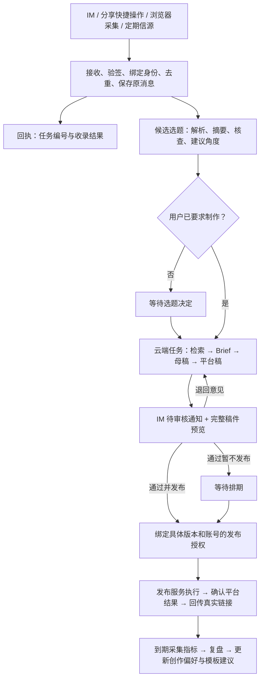

# 星火工厂：多入口个人内容助手任务路线图

更新：2026-10-06。当前接入方案：手机 Dot → Dot 云端 → HTTPS 收录 API；不依赖个人电脑，不使用插件。

统一收录 API、防重和受限凭证已实现，HTTPS 已配置，用户已部署前端。Dot 自有云端已无凭证 GET 收录接口并返回 405；安全授权、真实收录与手机离线验收仍未完成。详细证据、责任与下一步见 [Dot 云端接入任务记录](dot-cloud-intake.md)。禁止把 Mac 脚本成功记为手机 Dot 成功。

## 1. 最终目标与产品形态

用户在电脑或手机浏览 X、公众号、网页、视频平台时，可以分享链接、复制文本、转发可接收的内容，或发一句想法给星火工厂。系统可靠接收、保存来源、形成候选选题，并依据用户意图自动检索、核查、立项、生成母稿和平台版本。用户通过 IM 或网页查看并审核；经人类明确授权，发布执行服务将指定版本发送到指定账号，回传真实链接，随后跟进数据与复盘。

产品定位：**面向内容创作的个人 Agent，IM 是高频交互入口，Web 是编辑、资产、权限、任务与审计控制台，云端执行服务承担持续任务。** 不以手机端为唯一入口，不要求每次打开网站，不预先建设独立原生 App。

Web 页面本身不承担后台运行。关闭浏览器、退出聊天或关闭个人电脑后，已接收的云端任务仍应运行。当前 Codex 会话、个人 Skill 和桌面定时任务是过渡工具，不等同于生产部署中的常驻执行器。

线上入口：https://story.susense.cn/ 。2026-10-06 已重新验证证书通过正常 TLS 校验；正式登录、分享入口和回调仍须用最新构建验收。

## 2. 高频输入场景

| 场景 | 用户动作 | 系统应保存并执行 |
| --- | --- | --- |
| 电脑浏览 X 或网页 | 复制链接到机器人，附一句“从企业应用角度写” | 原始消息、URL、个人角度、来源时间；自动立项制作 |
| 手机浏览公众号 | 复制文章链接或分享给已验证可接收的入口 | 先收录，再尝试正文提取；不可读时请求粘贴摘录 |
| 浏览短视频 | 粘贴分享文案、短链或口令，附想法 | 原文、解析结果、来源平台；能获取合法字幕或用户提供文件时再分析内容 |
| 突然想到一个主题 | 发一句话，后续可补语音 | 保存原始意图；补充公开证据，生成候选或草案 |
| 看到图片、截图、文件 | 主动发送到机器人 | 保存附件及来源；OCR/转写注明可能误差，不将截图当完整文章 |
| 桌面高频采集 | 浏览器扩展或快捷操作发送当前 URL、标题、选中文字 | 用户触发后发送所选内容；不读取未选择的页面或持续监控剪贴板 |
| 定期发现选题 | 指定 RSS、站点、搜索主题 | 定时采集、去重、候选推荐，等待用户选定 |

首版稳定支持文字与 URL。语音、截图、文件和视频转写按阶段加入，不能承诺任意转发卡片或分享口令都可解析。拿到链接不等于拿到正文；采集失败也必须保留原始输入与错误原因。

## 3. 输入意图约定（默认值为建议，允许用户设置）

- 裸链接或“收藏一下”：进入选题库的待评估区，自动摘要、分类、核查、建议角度，暂不制作整套稿件。
- “做这个 / 写成 X 和公众号 / 从这个角度写”：用户已经选定方向，自动立项并制作到待审核。
- “补充到 #任务号”：作为同一任务补充，不创建重复项目。
- “改一下 #任务号”：生成新版本并重新提审。
- “通过”只作用于明确引用的审核请求；没有任务、版本上下文时不能猜测。
- “通过并发布”绑定稿件版本、目标账号、平台及排期。用户选择自动出稿模式后，裸链接也可直接制作到待审核，但不自动批准发布。

概念上所有输入汇入选题库；数据上仍区分信息来源、候选选题和已立项项目，避免收藏行为变成高成本制作任务。

## 4. 入口方案与建议顺序

当前首发：Dot → 已连接电脑上的通用 HTTP 适配器 → 云端 intake-gateway → 信源 / 候选选题。接入协议独立于 Dot，其他助手可复用。当前不是原生 MCP 插件，不假定 Dot 已安装连接。

| 方案 | 产品适配 | 接入边界 | 建议 |
| --- | --- | --- | --- |
| 飞书应用机器人 | 电脑/手机共用，私聊或指定群中交互 | 需应用、接收消息事件、身份绑定及回复权限；普通推送 webhook 不等于双向机器人 | 若日常使用飞书，可作为第一条验证链路 |
| 企业微信智能机器人 | 国内工作场景、微信生态相邻入口 | 官方 SDK 提供消息收发、卡片与事件；具体租户开通能力需实测；企业微信不等于个人微信好友机器人 | 若日常主要使用企微，优先于另开聊天工具 |
| 微信内的官方接入方案 | 最符合习惯微信的用户 | 需单独评估自有公众号收消息、微信客服等入口的实际账号资格、消息类型和回复限制；不假定能读取个人微信聊天或任意文章卡片 | 做资格与消息样本试验后定方案；不以非官方个人号托管作为首版依赖 |
| WhatsApp Business Platform | 海外浏览与沟通场景 | 面向业务账号的 API，需账号/号码配置、webhook 和出站规则验证；不是登录个人 WhatsApp 就自动具备机器人能力 | 若已高频使用 WhatsApp，作为海外入口；通知模板、费用和可用资格上线前复核 |
| 系统分享快捷操作 | 手机少切换页面 | 根据 iOS/Android 实际分享能力实现；不承诺纯网页在所有系统都能注册分享目标 | 首个 IM 跑通后补充 |
| 浏览器扩展 / 快捷采集按钮 | 电脑浏览文章、选中文字时效率高 | 用户主动触发；登录页面内容仅按用户明确选择采集，不复制会话令牌 | 第三阶段接入同一入口协议 |
| 网页极简输入框 | 通用兜底 | 登录后粘贴文字/链接，不要求填写整张项目表 | 与第一个 IM 共用后端，保留兜底 |

建议：**只先接通一个最常用 IM，再补网页快捷入口和分享操作；WhatsApp 等其他渠道复用同一生产管线。** 不同时实现全部渠道。用户提及的 Personal Agent 产品作为交互方向参考，本轮不据未核实产品名称推断其内部实现。

## 5. 目标流程

聊天中完成收录、查询、退回、短稿审核和发布授权；长文、来源对照、版本差异提供直达网页预览。所有渠道显示同一任务状态，消息历史不能充当唯一数据库。

## 6. 架构与数据任务

普通业务 CRUD 继续使用 Supabase Auth 与 RLS，不为 IM 新增一套重复业务后台。出现真实的持续运行需求后，在 sense-console 下建设最小执行服务；媒体执行仍独立。

- [x] 首版文字 / URL 接入：凭证绑定组织与用户，保存入口、消息 ID、原文、链接、接收时间、capture 意图和信源 / 选题关联；防重、撤销、到期、限流已实现。
- [ ] 扩展附件、关联既有任务及其他意图。
- [ ] 来源解析：短链解析、去重、取文结果、正文来源、抓取时间、可读状态；处理超时、登录限制和无字幕内容。外部 URL 获取限制私网目标、重定向、大小与时长。
- [ ] IM 身份与权限：通过已登录控制台绑定账号；核验事件来源，拒绝不属于组织的操作；网页与聊天使用同一审核权限。
- [ ] 持久化任务：状态、步骤、输入/输出版本、尝试次数、错误、心跳、成本与执行器版本；重启恢复、取消、有限重试、重复事件不重复制作。
- [ ] 原消息作为不可信资料处理，转发文章中的指令不能取得审核或发布权限。
- [ ] 消息回执与通知记录：先确认持久化接收再回执；业务处理失败与通知失败分开重试。
- [ ] 审核请求：任务、稿件版本、账号、平台、审核人、决定、时间、失效条件；改稿后旧按钮不能批准新稿。
- [ ] 发布授权与执行记录：人类决定和执行动作分离；Agent 不能自行批准。按人类授权执行的发布服务作为下一阶段能力，实施时同步调整现有规则说明。
- [ ] 平台连接：OAuth/凭据保存在可信服务端；连接状态、权限与过期状态可见。账号登记不代表连接成功。
- [ ] 发布结果不确定时先核对平台，不能直接重试产生重复帖子；成功后记录真实平台 ID 与链接。
- [ ] 复盘任务按实际发布时间计算 24/48 小时，记录实际观察时刻、数据来源和缺失值；无权限采集时请求人工回填，不编造结果。
- [ ] 持久偏好：受众、栏目、风格、默认平台、禁忌、用户明确反馈；事实记忆和风格偏好分开，不能把一次改稿默认为永久规则。

上述是待设计对象，不代表数据库已有这些表，也不预先规定必须为每项各建一张表。

## 7. 阶段任务与验收

### M0：生产环境与第一入口准备

- [ ] 修复域名 HTTPS，核验登录回跳、深链接刷新与移动网络访问。
- [ ] 确认线上部署环境、持续任务运行位置、日志和回滚方式。
- [ ] 解决文字模型权限或配置可用模型，完成真实生成测试。
- [ ] 选择一个首发 IM，用文字、网页 URL、公众号链接、短视频分享文本各做一条消息样本试验。

验收：已绑定用户发送消息，获得任务编号；重复投递只生成一条记录；不可解析输入也有可追踪状态。

### M1：随手输入到自动待审核

- [ ] 完成原消息 → 来源 → 候选选题；按明确制作意图自动立项。
- [ ] 云端检索核查、完整 Brief、母稿和平台版本，保存来源与版本。
- [ ] IM 回报完成/失败；从任务中断处恢复，不依赖用户电脑在线。
- [ ] 提供“只收藏 / 开始制作 / 补充信息 / 查询进度”基本交互。

验收：从不同设备发三种真实来源，关闭浏览器后继续执行并收到待审核通知；受限来源不伪称读取成功。

### M2：对话审核到真实发布 X

- [ ] IM 审核卡片/链接支持退回、通过暂存、通过并发布，展示版本与账号。
- [ ] 接通真实 X 授权、发布及回执；处理超时和重复点击。
- [ ] 至少验证一次退回重写、一次旧审核失效、一次成功发布及重试防重。

验收：用户无需打开控制台列表，在消息入口完成审核授权并收到真实帖子链接；内容、版本与账号完全匹配。

### M3：公众号、分享入口与复盘

- [ ] 核实公众号账号类型与实际权限，分别验收草稿、发布、群发能力，不混为一项。
- [ ] 补齐公众号封面、正文图片、摘要及排版预览。
- [ ] 手机分享快捷操作与桌面采集入口复用已有接收服务；再按习惯接 WhatsApp 或第二 IM。
- [ ] 实际发布后采集两次数据，形成有证据、可执行的改进建议。

验收：同一选题先 X 后公众号，各自审批和回执；真实数据与模拟数据隔离，未知指标保留为空。

### M4：稳定日常运行与视频扩展

- [ ] 连续一周真实使用，记录接收率、解析成功率、出稿等待时间、人工修改比例、发布成功率与重复发布次数。
- [ ] 自主采集每日候选供用户选择；按真实反馈迭代提示词和技能。
- [ ] 语音/图片输入、视频分镜与独立渲染接入相同任务和人工审核机制。

验收：从“能跑一次”走向可恢复的日常生产；具体性能目标在第一轮运行数据后确定，不提前宣称可靠性百分比。

## 8. 当前基础与仍未完成项

已有：云端来源/选题/内容项目、稿件版本、网页审核、人工发布计划、指标回填、只读演练包、首个光遗传学样例、文字 SOP 与个人 Skill。

未完成：IM 双向接收、云端整条流水线、消息审核、真实平台自动发布、自动指标采集。发布与复盘尾段此前仅做隔离事务演练。网站可访问不代表这些后台能力已上线。

## 9. 官方资料与调研边界

核查日期：2026-10-06。具体权限、定价、通知窗口和账号资格在接入时再次确认。

- 飞书接收消息事件：https://open.feishu.cn/document/server-docs/im-v1/message/events/receive
- 企业微信智能机器人官方 SDK：https://github.com/WecomTeam/aibot-node-sdk
- 企业微信消息回调文档：https://developer.work.weixin.qq.com/document/path/100719 （本次工具未直接读到正文，能力主要依据官方 SDK）
- Meta 官方 WhatsApp Business Platform API 集合：https://www.postman.com/meta/whatsapp-business-platform/folder/lboq68h/webhooks
- Meta 官方文档入口：https://developers.facebook.com/documentation/business-messaging/whatsapp/overview （本次抓取失败，不据此承诺当前收费或账号资格）
- X 发帖接口：https://docs.x.com/x-api/posts/create-post

本轮已部署通用收录服务；未创建 IM 应用或 Dot 原生插件，未部署发布执行服务。
