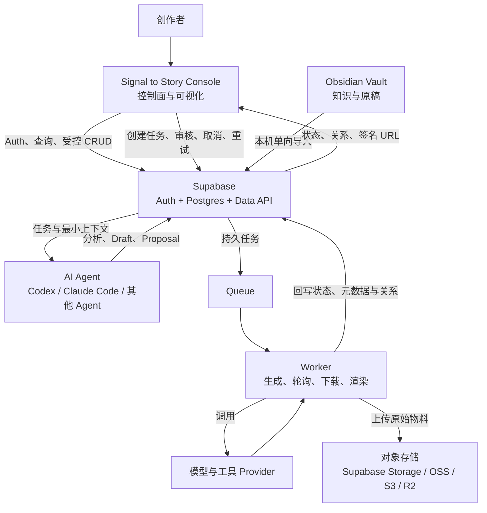

# Signal to Story 总体系统架构 SPEC

> [!abstract] 决策摘要
> Signal to Story Console 是内容生产系统的**控制面和资产关系可视化中心**；Supabase 管理身份、运行状态、对象关系和审计；Agent 与 Worker 构成异步执行面；图片、音频、视频等原始二进制物料保存在独立对象存储中。

相关文档：[[内容系统分层与Obsidian单向同步-SPEC]] · [[内容创作与AI-CMS指导-SPEC]] · [[../design/AI内容生产系统-PRD-v1]] · [[../plan/frame-work]]

---

## 1. 目的与适用范围

本 SPEC 是 `signal-to-story` 的上位系统架构约束，用于统一以下问题：

- `sense-console` 应该负责什么，不负责什么。
- 普通页面能否直接访问 Supabase。
- Supabase、对象存储和 Obsidian 分别保存什么。
- Agent 与 Worker 如何分工。
- 任务、内容和媒体资产如何形成可追溯关系。
- 当前阶段建立哪些骨架，哪些能力延后。

数据库表和字段不在本文件中定稿，后续由 `sense-console/docs/supabase-data-model.md` 单独设计，并通过 `sense-console/supabase/migrations/` 落地。

---

## 2. 系统定位

Signal to Story 是一个面向个人内容生产与 AI 协作的 **Content Ops 控制系统**，不是单纯的内容后台，也不是把所有模型和工具塞进一个进程的“超级 Agent”。

系统目标：

1. **可见**：随时看到选题、项目、任务、审核、资产和发布状态。
2. **可控**：能够创建、暂停、取消、重试和审核后台任务。
3. **可追溯**：任何结论、内容和成片都能追溯到来源、版本、任务、模型和人工决策。
4. **可复用**：人物、场景、脚本、分镜和媒体文件形成结构化关系，而不是散落在目录和聊天记录中。

产品展示名统一为 **Signal to Story**。`sense-console` 仅作为工程目录或技术标识，不作为用户可见产品名。企业及版权标识暂用 `susesne.cn`。

---

## 3. 总体架构



系统分为三个主要平面：

| 平面 | 组成 | 职责 |
| --- | --- | --- |
| 控制面 | `sense-console` | 人机交互、驾驶舱、可视化、指令下达和审核 |
| 状态与关系层 | Supabase | Auth、Postgres、Data API、任务、关系、审计及可选 Storage/Queue |
| 执行面 | Agent、Worker、Provider | 异步分析、内容生产、模型调用和媒体处理 |

对象存储与 Obsidian 是独立的数据来源，不随 Web 工程部署。

---

## 4. Sense Console 的职责

`sense-console/` 是 Signal to Story 的 Web 控制中心，负责：

- 个人驾驶舱、待办和关键状态汇总。
- 信息源、线索、选题和内容项目管理。
- 故事、脚本、分镜、人物、场景和发布计划展示。
- 任务调度面板以及任务状态、进度、耗时、错误和成本展示。
- 创建、取消、重试和审核任务。
- 查看 Agent 的分析结论、Draft 和 Proposal。
- 可视化内容、分镜、素材和成片之间的关系。
- 通过受控 URL 预览图片、音频、视频、字幕和封面。
- 人工选择候选素材，批准、退回或继续推进结果。
- 查看版本和审计记录。

Console 不负责：

- 在浏览器中执行长时间 Agent 或媒体生成任务。
- 直接运行 FFmpeg、Remotion 或 Provider 轮询。
- 保存生产媒体二进制文件。
- 持有 `service_role`、数据库密码或 Provider API Key。
- 代替 RLS 承担数据授权。

---

## 5. Supabase 的职责与访问模式

### 5.1 使用的 Supabase 能力

- **Auth**：V1 使用邮箱和密码登录、会话恢复与用户身份。
- **Postgres**：保存业务对象、状态、关系、任务、审核、版本、成本和审计。
- **Data API**：向 Web Console 提供受 RLS 保护的普通 CRUD。
- **Storage**：可作为私有媒体对象存储，也可以保存其他 OSS 的资产索引。
- **Realtime**：确有实时状态展示需求时启用；单人初期不是必需。
- **Queues**：出现真实异步执行需求后，用于持久任务和 Worker 消费。
- **Edge Functions**：处理需要服务端 Secret、Webhook、强校验或受控 Agent Gateway 的短请求。

### 5.2 普通 CRUD 不建设传统后台 API

登录、列表、详情和普通编辑由 `sense-console` 通过 `@supabase/supabase-js` 直接访问 Supabase。项目不为这些操作单独开发 Node、Java 或 Spring API 服务。

直接访问必须同时满足：

1. 浏览器只使用 Project URL 和 publishable key。
2. 明确配置表是否暴露给 Data API，以及 `anon`/`authenticated` 的 GRANT。
3. 每张暴露业务表启用 RLS。
4. RLS 绑定真实 owner 或 workspace membership，不能只写 `TO authenticated`。
5. UPDATE 同时设计 SELECT、USING 和 WITH CHECK。
6. 授权不依赖用户可修改的 `user_metadata`。
7. 页面通过 service/repository 层组织查询，不在组件中散写复杂数据库访问。

表能否被 Data API 访问与用户能访问哪些行是两层控制，缺一不可。

### 5.3 必须使用可信服务端的场景

以下能力不能放在浏览器中：

- 使用 `service_role`、Provider Key 或其他服务端 Secret。
- Context Pack 的受控生成和敏感字段过滤。
- Agent Proposal 的强 Schema 校验和任务令牌校验。
- 第三方 Webhook 与签名验证。
- 需要可信跨表事务或受控提权的操作。

这类短请求优先使用 Supabase Edge Functions 或严格设计的数据库函数。长时间任务不得通过普通 Edge Function 请求持续执行。

---

## 6. Agent 与 Worker 的职责

### 6.1 AI Agent

Agent 负责认知、分析和内容提案：

- 信息收集、去重、聚类和摘要。
- 选题分析、评分和研究计划。
- Brief、故事、文章和脚本草案。
- 人物、场景、分镜和素材需求设计。
- 内容适配和发布后复盘。

Agent 可以由 Codex、Claude Code 或其他具备工具调用能力的 Agent 执行。Agent 只能通过受控接口读取最小必要上下文并提交结构化 Proposal 或 Draft。

Agent 不得：

- 持有 Supabase `service_role`。
- 直接执行任意 SQL。
- 直接改写 Obsidian 原稿。
- 直接批准、发布或删除正式内容。
- 绕过预算、人工审核和状态机。

### 6.2 Worker

Worker 是未来独立运行、独立部署的后台进程，负责确定性或长时间任务：

- 调用图像、视频、TTS 和转写 Provider。
- 轮询异步生成任务。
- 下载 Provider 临时文件并写入自有对象存储。
- 执行 FFmpeg、Remotion、字幕、转码和渲染。
- 队列消费、超时、有限重试和失败恢复。
- 计算 Hash、提取媒体元数据和生成缩略图。
- 回写任务状态、成本、错误和资产关系。

Agent 决定“做什么、为什么、需要什么”；Worker 稳定执行“如何调用工具并交付文件”。

框架阶段不创建 Worker。出现真实长任务后，可在 `sense-console/workers/` 中建立独立运行入口；它与 Web Console 位于同一工程目录，但独立运行和部署。

---

## 7. 数据权威来源

| 内容类型 | 权威来源 | 规则 |
| --- | --- | --- |
| 深度研究、原稿、脚本和创作过程 | Obsidian Vault | 本机单向导入快照；CMS 不反向静默改写 |
| 任务、状态、关系、审核、版本、成本和审计 | Supabase Postgres | Console、Agent 和 Worker 共同依赖的运行事实库 |
| 图片、音频、视频、字幕和工程产物 | 对象存储 | 数据库只保存元数据、地址和关系 |
| Web 与执行代码 | `signal-to-story/sense-console` | 不混入 Vault 或生产媒体文件 |

Postgres 可以保存 Markdown 的最新只读快照和不可变 revision，用于在线预览、检索和 Context Pack；Obsidian 仍是深度正文的主编辑端。

---

## 8. 资产存储与关系

### 8.1 原始媒体不进入前端工程或 Postgres 字段

图片、音频、人物与场景建模、视频、字幕和封面等原始二进制物料不提交到 `sense-console` 源码，也不直接保存进普通 Postgres 字段。

资产元数据至少需要表达：

- 资产 ID、类型、状态和版本。
- Storage Provider、Bucket、Object Key 或受控外部地址。
- MIME、大小、Hash、尺寸和时长。
- 来源、作者类型、生成模型和 Prompt 版本。
- 授权、许可证和使用限制。
- 所属内容项目、故事、脚本、分镜或任务。
- 候选、选定、废弃和最终交付关系。

Web Console 使用短期签名 URL 或受控公开地址预览私有资产。

### 8.2 本地目录资产

原始文件可以暂存在独立本机目录，但浏览器不能直接读取任意本地路径。需要由本机同步器或 Worker：

1. 扫描明确授权的目录。
2. 计算 Hash 并读取媒体元数据。
3. 上传到对象存储，或登记为仅本机可用资产。
4. 将资产 ID、位置、状态和业务关系写入 Supabase。

本机绝对路径属于设备内部信息，不作为跨设备资产地址，也不直接返回给普通 Web 用户。

### 8.3 核心对象关系

```text
Source
  → Signal
    → Topic
      → Content Project
        → Brief
          → Story / Script
            → Scene
              → Media Job
                → Candidate Assets
                  → Selected Asset
                    → Final Output
                      → Publication
                        → Metrics / Retrospective
```

Agent Run、Proposal、审核记录、版本和成本贯穿上述对象。任一最终成片都应能回溯到选题、证据、脚本、分镜、任务、模型、素材和人工审核。

---

## 9. 标准任务执行闭环

1. 用户在 Console 创建任务或下达指令。
2. Supabase 保存任务、输入引用、预算、幂等键和初始状态。
3. Agent 或 Worker 领取任务并记录执行身份与版本。
4. 执行过程中持续回写进度、错误、耗时和成本。
5. 生成的原始文件进入对象存储。
6. 资产元数据、Hash、来源和对象关系写入 Supabase。
7. Console 展示结果和关系，由用户审核、选择、退回或继续推进。
8. 只有人工确认后的结果才能成为正式内容或进入发布流程。

每个异步任务至少具有：

- 明确状态机。
- 幂等键。
- 最大尝试次数。
- 超时与取消策略。
- 输入、输出和来源引用。
- Agent、模型、Prompt 和工具版本。
- 估算或实际成本。
- 人工审核结果。

---

## 10. 工程组织与演进条件

当前工程代码统一放在：

```text
signal-to-story/
├── sense-console/
│   ├── src/                    # React Web Console
│   ├── supabase/               # 配置、migration、RLS、Functions 和 seed
│   ├── docs/                   # 数据模型和工程设计
│   └── workers/                # 真实长任务出现后再创建
├── docs-site/
└── README.md
```

当前不创建 `packages/`。只有 Web、Worker 或本机同步器需要共享同一套版本化 Schema 时，才将 `sense-console/src/contracts/` 提升为 `sense-console/packages/contracts/`。

`sense-console/supabase/` 不是传统后台服务，而是 Supabase 配置、migration、RLS、Storage Policy、seed 和必要 Edge Functions 的代码化记录。

---

## 11. 当前实施边界

当前阶段建立：

- React + shadcn/ui Base UI 的 `sense-console` 工程基座。
- Signal to Story 品牌配置和 Logo 替换接口。
- Supabase 邮箱和密码登录、会话与路由守卫。
- 两层以内菜单、驾驶舱骨架、列表和详情页面模式。
- Supabase Client、数据访问层、环境变量和本地目录。
- Agent Contract、幂等、审计和安全边界。
- 独立数据库模型设计文档的位置与要求。

当前阶段不建立：

- 独立传统后台 API 服务。
- 完整业务数据库模型。
- 通用 Agent 编排平台。
- Media Worker 和完整媒体生产流水线。
- 自动发布系统。
- 三级菜单、多标签企业工作台或复杂权限配置中心。
- Obsidian 与 CMS 的双向正文同步。

---

## 12. 架构原则

1. **Console 管控制，不承担长任务。**
2. **Supabase Postgres 管状态和关系，不存大型二进制文件。**
3. **对象存储管原始物料，数据库保存可审计索引。**
4. **Agent 提交提案，人类保留最终决策权。**
5. **Worker 负责可靠执行，任务必须可重试、可取消、可追踪。**
6. **Obsidian 是原稿主编辑端，CMS 不静默反向覆盖。**
7. **前端可直连 Supabase，但必须由 RLS 保证数据安全。**
8. **先验证单条真实链路，再增加抽象、模型和自动化。**
9. **所有正式产物都能追溯来源、版本、成本和人工审核。**
10. **用户可见品牌统一为 Signal to Story。**

> [!success] 完成定义
> 任一正式内容或媒体产物，都能在 Console 中找到其状态、来源、任务、版本、资产关系、执行记录和人工审核；任何 Agent、Worker 或浏览器都不能绕过既定权限和人类门禁。
