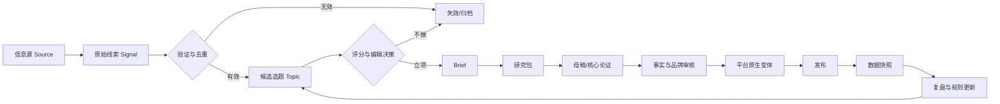
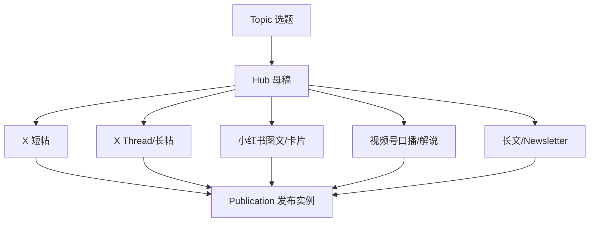
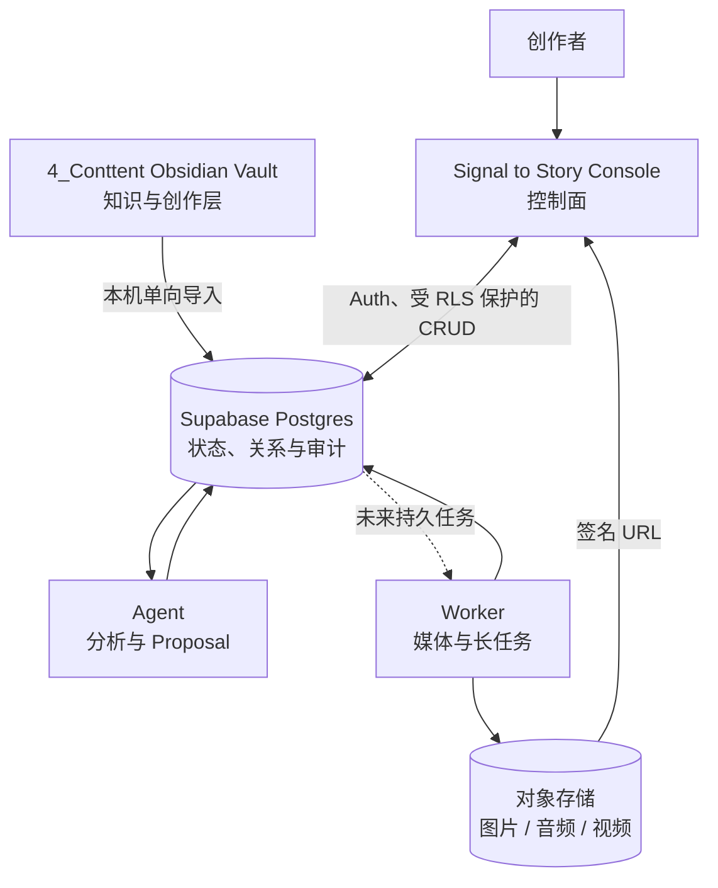

# 内容创作与 AI-CMS 指导 SPEC

> [!abstract] 一句话结论
> 把 `4_Conttent` 从“资料堆放目录”升级成个人 IP 的 **Content Operating System**：以“AI 如何真正变成产品、系统和生意”为核心认知标签，用结构化情报、分级选题、一题多载体、AI 辅助生产、人类终审和数据复盘形成可持续复利。

> [!success] 当前生效的定位
> **AI 时代的技术商业决策者**：18 年技术与产品实战，研究 AI、Agent 与企业数字化，拆解 AI 产品、技术架构与商业模式，讲清楚 AI 怎么真正进入企业和生意。

相关入口：[[READMD]] · [[Signal-to-Story总体架构-SPEC]] · [[1.内容管理/1. gpt建议|GPT 建议]] · [[1.内容管理/2.claude建议|Claude 建议]] · [[1.内容管理/3.Gemini建议|Gemini 建议]]

项目级需求与分期实施以 [[99.系统与自动化/PRD/AI内容生产系统-PRD-v1]] 为准。

---

## 1. 目标、边界与设计原则

### 1.1 系统目标

这个目录不只是写作文件夹，而要同时承担六种职责：

1. **雷达**：持续发现 AI、产品、企业与行业变化。
2. **判断系统**：从噪声中识别值得投入的信号和选题。
3. **生产系统**：把经验、证据和观点转化为内容资产。
4. **分发系统**：为 X、小红书、视频号等平台生成原生版本。
5. **学习系统**：用发布数据和真实反馈修正定位、选题和表达。
6. **商业系统**：把精准影响力转化为咨询、培训、课程、产品与合作机会。

### 1.2 非目标

- 不追求自动搬运、洗稿或无人工审核的“内容农场”。
- 不把粉丝量视为唯一目标；精准受众、专业信任和商业线索更重要。
- 不让平台热点反向绑架长期定位。
- 不把 Obsidian 和 Supabase 维护成两份互相冲突的正文真相。
- 不在流程尚未稳定前开发一个功能过重的 CMS。

### 1.3 六条原则

> [!important] 系统原则
> 1. **一条内容只有一个核心判断。**
> 2. **证据先于表达，判断高于信息。**
> 3. **一个母题，多种载体；不是同一文案全平台复制。**
> 4. **AI 负责扩展、压缩和转换，人负责事实、判断、审美与责任。**
> 5. **文件保存知识正文，数据库保存流程状态与高频数据。**
> 6. **所有发布都必须回流数据和经验，形成闭环。**

---

## 2. 个人 IP 定位

### 2.1 三份建议的共同结论

| 共识 | 最终决策 |
| --- | --- |
| 不能做泛科技或纯工具教程 | 工具内容只做入口，不做身份标签 |
| 稀缺性来自技术、产品、商业和企业实战交叉 | 所有核心内容至少连接其中两个维度 |
| AI Agent/企业落地兼具需求和专业壁垒 | 作为主赛道 |
| 技术负责人、产品负责人决策经验价值高 | 作为信任与变现支柱 |
| 医疗、保险、金融经验难复制 | 作为案例矿山和专业纵深，不把品牌锁死在医疗 |
| 一人公司、创业和转型有传播力 | 作为人格化副线，不替代核心定位 |

### 2.2 定位表达

**正式定位：**

> 站在技术、产品、商业和企业管理的交叉点，讲清楚 AI 如何真正变成产品、系统和生意。

**短 Bio：**

> 18 年技术与产品实战｜前大型平台技术产品负责人  
> 研究 AI、Agent 与企业数字化  
> 拆解 AI 产品、技术架构与商业模式

**视频/播客开场：**

> 我不只追 AI 热点，我更关心它怎么落到业务、系统与 ROI。

**希望形成的认知标签：**

> “那个专门讲 AI 企业落地，而且技术、产品、商业都懂的人。”

### 2.3 目标受众优先级

| 层级 | 受众 | 核心问题 | 希望形成的行动 |
| --- | --- | --- | --- |
| P1 | 创业者、企业负责人、CTO、产品负责人 | AI 是否值得做、从哪里做、ROI 和风险是什么 | 关注、转发给团队、咨询/培训 |
| P2 | 架构师、技术经理、AI 产品经理 | Agent/RAG/Workflow 怎么设计和落地 | 收藏、订阅、参加课程/社群 |
| P3 | 资深开发者、独立开发者、技术转型者 | 如何从“写代码”升级到做产品和决策 | 长期关注、购买工具/课程 |
| P4 | 对 AI 商业和产业趋势感兴趣的大众 | 这次变化和自己有什么关系 | 互动、分享、进入深度内容 |

> [!warning] 受众取舍
> 如果一个选题只能带来泛流量，却不能强化“AI 企业落地/技术商业判断”的标签，默认降级处理。人格化内容可以拓宽关系，但不能连续占据主发布位。

### 2.4 内容价值阶梯

1. **热点与观点**：获得注意力。
2. **解释与拆解**：建立认知差异。
3. **方法与框架**：建立专业信任。
4. **案例与证据**：形成能力背书。
5. **咨询/培训/产品**：承接高价值需求。

---

## 3. 内容分类：用三个正交维度代替“一个文件夹一个世界”

目录只表达生命周期；主题、内容视角和载体使用 Obsidian Properties 表达。三者不要混在同一套文件夹里。

### 3.1 维度 A：内容支柱——“1 + 3 + N”

#### 1 个核心母题

> **AI × 企业 × 产品 × 商业**

#### 3 个长期支柱

| code | 支柱 | 作用 | 典型选题 | 建议占比 |
| --- | --- | --- | --- | ---: |
| `P1` | AI 商业与产业判断 | 流量入口 | SaaS 会不会被 Agent 重构；大厂为何调整 AI 组织 | 30% |
| `P2` | AI 产品与 Agent 工程化 | 专业壁垒 | Agent 权限、Memory、RAG、Evaluation、HITL | 35% |
| `P3` | CTO / 产品负责人决策实战 | 信任与变现 | 重构决策、团队治理、复杂项目、ROI | 25% |
| `P4` | 创业、转型与个人叙事 | 人格连接 | 技术老兵转型、一人公司、真实成败复盘 | 10% |

#### N 个案例矿山

医疗、妇幼健康、保险、金融、证券、SaaS、企业服务、出海、开发者工具和大厂战略，都挂在上面的支柱下。它们是证据与差异化，不是并列的新赛道。

### 3.2 维度 B：表达视角——4A Framework

Dickie Bush / Ship 30 for 30 的 4A 方法把同一主题分成四种表达路径：

| angle | 回答的问题 | 适合你的表达 | 例子 |
| --- | --- | --- | --- |
| `actionable` | 怎么做 | SOP、清单、框架、教程 | 企业 Agent 上线前的 12 项检查 |
| `analytical` | 数据和机制是什么 | 趋势、数字、拆解、对比 | 为什么 80% AI Demo 无法进入生产 |
| `aspirational` | 什么是可能的 | 个人故事、转型、教训、里程碑 | 18 年技术人如何重建 AI 能力栈 |
| `anthropological` | 为什么人会这样 | 悖论、心理、组织与权力 | 企业最难的不是模型，而是责任分配 |

你的优势应优先组合：

- `analytical + actionable`：建立专业壁垒。
- `aspirational + anthropological`：建立个人连接。
- `analytical + anthropological`：输出高传播的产业判断。

### 3.3 维度 C：内容意图

| intent | 目标 | 常用 CTA |
| --- | --- | --- |
| `reach` | 新受众发现 | 关注、转发、参与讨论 |
| `trust` | 证明能力和判断 | 收藏、查看完整案例、订阅 |
| `community` | 建立关系和对话 | 评论经历、投票、提问 |
| `conversion` | 承接明确需求 | 下载清单、预约咨询、参加培训 |
| `retention` | 让老受众持续获得价值 | 系列追更、周报、专题导航 |

> [!tip] 分类规则
> 每条内容必须有 1 个主支柱、1 个主视角、1 个主意图。可以有副标签，但不要用十几个标签代替判断。

### 3.4 从高互动样本中保留什么

结合 [[2.X策略研究/5.X研究对象分析]] 与 [[3.X上资源/纯洁微笑涨幅分析]]，保留以下可复制因素：

- 真实经历或一手观察，而不是悬空结论。
- 开头有清晰冲突，正文有机制解释，结尾有行动或判断。
- 长内容结构化、短内容有单一记忆点。
- 实用价值和情绪价值至少占一个，最好组合。
- 稳定发布、持续对标、用数据复盘。

不复制以下风险做法：

- 用无法核验的夸张数字制造焦虑。
- 把相关性写成因果，把个案写成普遍规律。
- 每条都用“残酷真相”“99%”等模板化情绪钩子。
- 为互动牺牲品牌长期可信度。

---

## 4. 目录信息架构

### 4.1 现状诊断

当前目录的优点是已经积累了定位建议、X 策略、平台资源和 Prompt；主要问题是：

- 文件夹同时混用“阶段”“平台”“内容类型”三种分类标准。
- `1.内容管理` 同时包含战略建议、选题草稿和案例，边界过宽。
- `3.X上资源` 既有原始素材，又有成稿、提示词、分析报告甚至 JSON。
- 没有独立的情报 Inbox、选题池、生产状态、发布记录和复盘区。
- 文件缺少统一 Properties，后续 AI 和 CMS 难以可靠识别。
- Prompt 与生产任务未建立版本、输入输出和评估关系。

### 4.2 目标目录

```text
4_Conttent/
├── 00.控制台/
│   ├── 内容仪表盘.md
│   ├── 本周编辑会.md
│   └── 发布日历.md
├── 10.战略与规范/
│   ├── 内容创作与AI-CMS指导-SPEC.md
│   ├── 品牌定位与BIO.md
│   ├── 受众与价值主张.md
│   ├── 平台策略/
│   └── 参考建议/
├── 20.信息源/
│   ├── 人物与账号/
│   ├── 媒体与机构/
│   ├── 官方文档与论文/
│   └── 订阅与监控清单/
├── 30.情报与线索/
│   ├── 00.Inbox/
│   ├── 10.已验证信号/
│   ├── 20.专题观察/
│   └── 90.失效线索/
├── 40.选题池/
│   ├── P0.即时响应/
│   ├── P1.趋势窗口/
│   ├── P2.计划专题/
│   ├── P3.常青储备/
│   └── 90.搁置与淘汰/
├── 50.内容生产/
│   ├── 10.Brief/
│   ├── 20.研究包/
│   ├── 30.大纲/
│   ├── 40.初稿/
│   ├── 50.审核中/
│   └── 60.待发布/
├── 60.发布与分发/
│   ├── X/
│   ├── 小红书/
│   ├── 视频号/
│   ├── 长文与Newsletter/
│   └── 发布记录/
├── 70.数据与复盘/
│   ├── 日报与周报/
│   ├── 内容复盘/
│   ├── 爆款与失败样本/
│   └── 实验记录/
├── 80.素材索引/
│   ├── 素材清单与版权/
│   ├── 本地参考图/
│   ├── 图表与引语索引/
│   ├── 品牌规范与模板/
│   └── 项目素材引用/
├── 90.归档/
│   └── YYYY/
└── 99.系统与自动化/
    ├── Templates/
    ├── Prompts/
    ├── Schemas/
    ├── Automations/
    ├── PRD/
    └── 架构与同步规范/
```

### 4.3 为什么按生命周期分目录

- 一条内容从线索到发布会移动阶段，文件位置直接表达当前状态。
- 主题、平台和格式会交叉，适合用 Properties 和链接，而非复制文件。
- AI Agent 可以根据目录边界获得更可靠的任务上下文。
- 将来 CMS 能直接映射生命周期状态，不必重做信息模型。
- 本 Vault 保持为知识与创作层，不承担工程源码、密钥、数据库导出或长期生产二进制资产。

### 4.4 现有目录迁移映射

| 当前目录 | 目标位置 | 处理原则 |
| --- | --- | --- |
| `1.内容管理/` 中的三份建议 | `10.战略与规范/参考建议/` | 原文保留，只统一格式 |
| `1.内容管理/` 中的创作随想和案例 | `30.情报与线索/` 或 `50.内容生产/40.初稿/` | 按是否已有明确观点判断 |
| `2.X策略研究/` | `10.战略与规范/平台策略/X/` | 策略与具体样本分离 |
| `3.X上资源/` | 拆到 `20`、`30`、`70`、`80` | 不再用平台作为全部资源的总分类 |
| `4.prompt/` | `99.系统与自动化/Prompts/` | 每个 Prompt 增加用途、版本、输入输出 |

> [!warning] 迁移策略
> 当前版本只给出目标结构，不立即批量移动旧文件。先让新内容按新规范运行 2–4 周，再分批迁移；每次移动后检查 Obsidian 双链和嵌入资源。

---

## 5. 内容生命周期与状态机



### 5.1 标准状态

| status | 含义 | 进入条件 | 退出条件 |
| --- | --- | --- | --- |
| `captured` | 已捕获 | 有链接/截图/口述记录 | 完成去重和初步分类 |
| `validated` | 已验证 | 来源与事实基本可靠 | 转为选题或归档 |
| `candidate` | 候选选题 | 有受众问题和初步观点 | 评分通过 |
| `commissioned` | 已立项 | 有负责人、截止时间、平台 | Brief 完整 |
| `researching` | 研究中 | 已列事实、反方与证据缺口 | 研究包达到最低标准 |
| `drafting` | 创作中 | 核心论点确定 | 母稿完整 |
| `reviewing` | 审核中 | 完成初稿 | 事实/品牌/平台审核通过 |
| `ready` | 待发布 | 平台变体和素材就绪 | 发布或改期 |
| `published` | 已发布 | 有平台 URL/ID | 完成观察期数据采集 |
| `reviewed` | 已复盘 | 有 24h/7d 数据和结论 | 进入常青资产或归档 |
| `archived` | 已归档 | 不再活跃 | 必要时重新激活 |

### 5.2 WIP 限制

为了避免“囤积式创作”：

- 同时 `commissioned` 的选题不超过 8 个。
- 同时 `drafting` 的内容不超过 3 个。
- 同时 `reviewing` 的内容不超过 3 个。
- 新选题立项前，优先完成或终止旧 WIP。

---

## 6. 信息源与情报系统

### 6.1 信息源分级

| source_tier | 类型 | 示例 | 使用规则 |
| --- | --- | --- | --- |
| `S0` | 一手/官方 | 官方文档、财报、论文、访谈原片、亲历数据 | 可作为关键事实依据 |
| `S1` | 高可信专业源 | 权威媒体、资深从业者一手分析 | 关键结论尽量交叉验证 |
| `S2` | 社交信号源 | X 博主、社群讨论、评论区 | 用于发现问题，不直接当事实 |
| `S3` | 未知或营销源 | 聚合号、无出处截图、带强销售目的内容 | 只进 Inbox，验证前不引用 |

### 6.2 定向情报域

固定监控以下领域：

1. 企业 AI、Agent、RAG、Workflow、Evaluation。
2. AI 产品设计、MCP、权限、Memory、人机协同。
3. 大厂 AI 战略、组织调整、商业模式与生态。
4. ToB SaaS、数字化转型、复杂系统与工程治理。
5. 医疗、保险、金融中的 AI 落地案例。
6. 创作者经济、一人公司、AI Native 产品与出海。

### 6.3 线索最小记录

每条线索至少包含：

- 原始 URL 或附件。
- 来源作者、发布时间、抓取时间。
- 一句话摘要。
- 为什么与定位相关。
- 可信度与待核验项。
- 可延展的内容支柱和受众问题。

### 6.4 去重与聚类

- URL 规范化后做精确去重。
- 标题与正文摘要做语义相似聚类。
- 同一事件的多来源不合并删除，而是聚合为一个 `story_cluster`。
- 保留“最早来源、最高可信来源、最强传播来源”三个角色。
- AI 可以建议合并，但不得自动删除原始证据。

---

## 7. 热点与选题分级

### 7.1 时效优先级

| priority | 窗口 | 适用内容 | 默认 SLA |
| --- | --- | --- | --- |
| `P0` | 即时 | 与品牌强相关的重大突发、官方发布 | 2 小时内决定做/不做 |
| `P1` | 24–72 小时 | 趋势性事件、有独特分析空间 | 24 小时内完成 Brief |
| `P2` | 1–4 周 | 计划专题、案例拆解、系列内容 | 纳入周/月编辑计划 |
| `P3` | 常青 | 方法论、框架、经验复盘 | 作为稳定内容库存 |

> [!important] 热点原则
> 不抢“发生了什么”的第一时间，争取“这意味着什么、为什么、企业该怎么办”的第一判断。

### 7.2 选题评分模型

每项 0–5 分：

| 维度 | 权重 | 判断问题 |
| --- | ---: | --- |
| 定位匹配 `fit` | 25% | 是否强化 AI 企业落地/技术商业决策标签？ |
| 受众痛点 `pain` | 20% | P1/P2 受众是否正在为此做决策？ |
| 独特优势 `authority` | 20% | 是否有一手经验、案例或跨界判断？ |
| 时机窗口 `timing` | 15% | 现在发布是否比一个月后更有价值？ |
| 证据质量 `evidence` | 10% | 是否有足够 S0/S1 证据？ |
| 复用杠杆 `leverage` | 10% | 能否形成系列或多平台资产？ |

```text
base_score = fit*0.25 + pain*0.20 + authority*0.20
           + timing*0.15 + evidence*0.10 + leverage*0.10

final_score = base_score - risk_penalty
```

风险扣分 `risk_penalty` 为 0–2，覆盖：事实未证实、合规/隐私、与专业身份冲突、只有情绪没有增量。

决策阈值：

- `>= 4.0`：优先立项。
- `3.3–3.9`：进入候选，补证据或换角度。
- `2.5–3.2`：只在低成本格式中实验。
- `< 2.5`：归档或淘汰。

### 7.3 编辑决策问题

立项前必须回答：

1. 目标受众是谁？他正在做什么决策？
2. 我比通用 AI 总结多提供了什么？
3. 核心判断能否压缩成一句可反驳的话？
4. 哪条证据最强？哪条反方意见最危险？
5. 做完后能强化哪个长期标签？
6. 最适合哪种母稿和首发平台？

---

## 8. 从选题到母稿

### 8.1 Brief 的最低标准

- `audience`：具体到角色与情境。
- `problem`：用户为什么现在关心。
- `thesis`：一句可验证、可反驳的核心判断。
- `promise`：读完获得什么。
- `evidence`：至少 2 个可靠来源；强事实尽量有 S0。
- `first_hand`：一手经历、项目数据或真实观察。
- `counterpoint`：最强反方观点。
- `angle`：4A 主视角。
- `intent`：传播、信任、社群、转化或留存。
- `formats`：计划生成的载体和平台。
- `cta`：只保留一个主行动。

### 8.2 母稿结构

推荐默认结构：

1. **结论/冲突**：先说最值得记住的判断。
2. **问题与 stakes**：为什么这件事值得关心。
3. **机制解释**：不要只列现象。
4. **证据与案例**：数据、一手经验、来源。
5. **反方与边界**：在什么条件下不成立。
6. **方法/行动**：读者下一步怎么做。
7. **记忆点/CTA**：收束为一句话和一个行动。

### 8.3 AI 参与边界

| 环节 | AI 可以做 | 必须人工负责 |
| --- | --- | --- |
| 捕获 | 摘要、分类、实体抽取、去重建议 | 确认来源和权限 |
| 选题 | 角度扩展、评分草案、反方生成 | 决定是否立项 |
| 研究 | 查询规划、证据表、矛盾检测 | 阅读关键原文、确认事实 |
| 写作 | 大纲、初稿、压缩、标题变体 | 核心判断、真实经历、最终措辞 |
| 适配 | 转换为平台原生结构 | 审美、语气和发布时机 |
| 审核 | 风险扫描、引用检查、重复度检查 | 事实责任、合规与最终发布 |
| 复盘 | 归因假设、模式聚类 | 判断因果并更新策略 |

> [!danger] 禁止自动化
> AI 不得编造个人经历、客户案例、项目数据、引用、截图或“网友反馈”；不得在未经人工确认时自动发布高风险内容。

---

## 9. 一题多载体、多平台原生化

### 9.1 Hub-and-Spoke 与 1-3-5

采用 Justin Welsh 的 Hub-and-Spoke/1-3-5 思路：

- **1 个 Hub**：完整母稿，可以是长文、长视频或深度 Thread。
- **3 个核心子观点**：每个能独立成立。
- **每个子观点 5 种微内容**：短帖、短视频、卡片、问答/投票、案例/金句等。

不是每次都机械生成 16 条；它是复用上限和素材地图。优先发布最适合平台的 3–6 个版本。

### 9.2 内容对象关系



### 9.3 平台适配规范

#### X

- 适合：强观点、实时判断、结构化长帖、公开构建、行业对话。
- 开头：一句冲突或反常识判断，不先铺背景。
- 正文：短段落；Thread 每一段都能推动论证。
- 证据：关键数字给来源，避免“据说”。
- CTA：提问、收藏、查看完整拆解三者选一。
- 重点指标：高质量回复、目标受众关注、Profile visit、收藏/书签、长帖展开与停留。

#### 小红书

- 适合：清单、避坑、方法、职业转型、案例故事、视觉框架。
- 封面：问题 + 结果，避免堆太多字。
- 正文：场景化标题、可截图的小节、明确步骤。
- 载体：6–10 页卡片或短图文；每页一个信息单元。
- CTA：收藏、评论具体问题或索取模板。
- 重点指标：收藏率、搜索流量、评论问题质量、主页访问。

#### 视频号

- 适合：负责人视角、故事复盘、复杂问题口语解释、系列访谈。
- 前 3 秒：结论或代价，不做冗长自我介绍。
- 结构：Hook → stakes → 3 个要点 → 结论/行动。
- 建议时长：单观点 45–90 秒；案例拆解 2–5 分钟。
- 画面：口播 + 架构图/数据卡/案例截图，不靠无关 B-roll。
- 重点指标：完播、平均观看时长、转发、关注转化、私信线索。

#### 长文 / Newsletter

- 适合：系统论证、方法论、案例复盘、可长期搜索和引用的资产。
- 它是 Hub，不是短帖的拼接。
- 必须有摘要、目录、证据、边界、行动清单和相关文章。
- 重点指标：订阅、回复、引用、咨询线索、后续复用次数。

### 9.4 内容节奏建议

每周基础节奏：

- 1 个深度 Hub。
- 2 个分析/方法类内容。
- 1 个真实经历或案例。
- 1 个互动/问题型内容。
- 其余位置只在有强信号时做热点响应。

在形成稳定产能前，不以日更为硬性 KPI；优先保证每周至少一个可复利的高质量资产。

---

## 10. Obsidian 数据规范

### 10.1 通用 Properties

```yaml
---
schema_version: 1
content_id: cnt_01JXXXXXXX
title: 示例标题
doc_type: topic_brief # research | topic_brief | content_draft | script | storyboard | retrospective
sync: false
created: 2026-08-20
updated: 2026-08-20
owner: Jarvis
pillar: P2
domains:
  - AI-Agent
  - 企业落地
angle: analytical
intent: trust
priority: P2
audience:
  - CTO
  - AI产品经理
formats:
  - article
platforms:
  - X
  - 小红书
source_ids: []
parent_id:
canonical_id:
publish_at:
tags:
  - 内容创作/选题
---
```

### 10.2 字段规则

- `content_id`：创建后永不改变，用于 Obsidian、CMS、媒体任务和发布数据对齐；旧笔记的 `id` 在迁移时映射到此字段。
- `doc_type`：表达可导入内容对象类型，不表达主题。
- `sync`：默认 `false`；仅当作者明确允许单向导入 CMS 时设为 `true`。
- CMS 工作流 `status`、审核、排期、发布和指标不应作为 Markdown 的权威字段；这些由 CMS 管理。
- `pillar`：只允许一个主支柱。
- `domains`：最多 3 个稳定领域词。
- `angle`、`intent`：各选一个主值。
- `canonical_id`：平台变体指向母稿。
- `source_ids`：事实和素材必须可追溯。
- 日期统一使用 `YYYY-MM-DD`；时间使用带时区 ISO 8601。

### 10.3 文件命名

推荐：

```text
YYYYMMDD-核心主题-对象类型.md
```

示例：

```text
20260820-Agent权限不是登录问题-brief.md
20260822-Agent权限不是登录问题-x-thread.md
```

稳定 ID 放在 Properties，不放文件名；标题可以优化，ID 不变。

### 10.4 链接规则

- 选题链接到所有信号：`topic -> signal`。
- 母稿链接到 Brief 与研究包：`content -> brief/research`。
- 平台版本链接到母稿：`variant -> canonical content`。
- 复盘链接到所有发布实例：`retrospective -> publication`。
- 来源保留外链，内部分析使用 Obsidian 双链。

---

## 11. 质量门禁

### 11.1 事实门禁

- [ ] 所有关键数字有来源和时间范围。
- [ ] 新闻区分“发生时间”和“报道时间”。
- [ ] 至少阅读了关键 S0/S1 原文，而非只读摘要。
- [ ] 引用没有断章取义。
- [ ] 个人推断明确写成判断，而非既成事实。
- [ ] AI 生成内容中的人名、版本、价格、政策和链接已复核。

### 11.2 品牌门禁

- [ ] 内容强化至少一个核心支柱。
- [ ] 有自己的经验、框架或判断增量。
- [ ] 没有为了流量制造与身份冲突的极端表述。
- [ ] 不泄露客户、公司、患者、同事或家人的敏感信息。
- [ ] 商业合作和利益关系透明。

### 11.3 表达门禁

- [ ] 首屏能看懂核心判断和受众收益。
- [ ] 一条内容只有一个主结论。
- [ ] 每个段落推动论证，没有重复填充。
- [ ] 术语首次出现时给出普通人可理解的解释。
- [ ] 有边界、反方或适用条件。
- [ ] CTA 只有一个。

### 11.4 发布门禁

- [ ] 平台版本是原生改写，不是机械复制。
- [ ] 标题、封面、字幕、链接和素材版权已检查。
- [ ] 已记录 `canonical_id`、平台、计划时间和实验变量。
- [ ] 已安排 24 小时、7 天数据采集。

---

## 12. 数据指标与复盘

### 12.1 北极星指标

> **每月由内容产生的“合格关系”数量**：目标受众的高质量关注、回复、订阅、私信、转介绍、咨询和合作机会。

粉丝和曝光是上游指标，不是最终价值。

### 12.2 指标分层

| 层级 | 指标 | 用途 |
| --- | --- | --- |
| 产能 | Hub 数、发布数、周期时间、WIP、复用率 | 判断流程是否稳定 |
| 注意力 | 曝光、播放、首屏停留、打开率 | 判断包装与分发 |
| 质量 | 完读/完播、收藏、转发、高质量回复 | 判断内容价值 |
| 受众 | Profile visit、目标人群关注、订阅 | 判断定位匹配 |
| 商业 | 私信、咨询、会议、成交、客单价 | 判断价值承接 |
| 资产 | 常青内容比例、被引用次数、二次复用次数 | 判断长期复利 |

### 12.3 不跨平台硬比较绝对数

平台口径不同，使用平台内相对比较：

- 与账号近 10 条内容的中位数比较。
- 同支柱、同格式、相似发布时间比较。
- 同时记录曝光和高意图行为，不只看点赞。
- 小样本只形成假设，不形成“算法结论”。

### 12.4 每条内容的复盘模板

1. 原假设是什么？
2. 结果相对基线如何？
3. 哪个环节最可能影响结果：选题、证据、Hook、结构、素材、平台或时机？
4. 评论区暴露了哪些新问题和反方？
5. 是否值得常青化、重写、跨平台或做成系列？
6. 下次只改变哪个变量？

### 12.5 实验纪律

- 每个实验只设一个主变量。
- 预先记录假设、基线、观察窗口和成功阈值。
- 不用一条爆款证明方法有效，也不用一条低迷否定主题。
- 连续 3–5 个同类样本后再调整规则。

---

## 13. AI Native CMS 目标架构

### 13.1 总体架构



本节只保留内容系统视角的摘要。控制面、执行面、对象存储、任务闭环和安全边界以 [[Signal-to-Story总体架构-SPEC]] 为准。

### 13.2 知识、工程、运行与素材的职责边界

| 层 | 权威内容 | 存放位置 | 不应承载 |
| --- | --- | --- | --- |
| 知识与创作层 | 长文正文、思考过程、框架、研究、脚本、复盘 | 当前 `4_Conttent/` Obsidian Vault | 应用代码、密钥、数据库导出、长期视频二进制 |
| 控制与工程层 | Web Console、migration、Schema、测试与部署 | `signal-to-story/sense-console/` | Vault 全量副本、生产媒体素材、真实密钥 |
| 运行状态层 | 状态、关系、评分、任务、审计和指标 | Supabase Postgres | Markdown 主编辑体验、大型二进制物料 |
| 素材层 | 图片、音频、视频、字幕和工程产物 | Supabase Storage、OSS、S3、R2 或受控本地目录 | 工作流状态、源码真相 |
| 执行层 | Agent 分析与 Proposal；未来 Worker 媒体执行 | 受控 Agent 会话及独立运行进程 | 正式批准权、发布权、无限数据库权限 |

**权威源与同步规则：**

- `content.body` 的主编辑权威源是 Obsidian Markdown。
- CMS 保存 Markdown 的完整只读快照、相对路径、`content_hash` 和不可变导入版本，以支持预览、检索和 Context Pack；它不是第二个正文编辑端。
- CMS 是评分、审核、排期、发布、媒体任务、素材关系、指标和 Agent Run 的权威源。
- 仅 `sync: true` 的 Markdown 由**本机同步器单向导入** CMS；CMS、Agent 与 Worker 不能反向静默写入 Vault。
- 文件改名/移动依赖不变的 `content_id` 关联；本地删除只标记待处理，不自动删除 CMS 内容、发布或素材。
- AI/编辑在 CMS 的正文改写只作为 Proposal/Revision；需要回到 Markdown 时由人工确认。

详细协议、错误处理与工程边界见 [[99.系统与自动化/内容系统分层与Obsidian单向同步-SPEC]]。

### 13.3 概念对象与数据模型边界

本 SPEC 只定义内容域中的概念对象，不把概念名称直接当成最终数据库表：

- Source、Signal、Story Cluster、Topic。
- Content Project、Brief、Canonical Draft、Variant。
- Story、Script、Scene、Media Job、Asset。
- Publication、Metric Snapshot、Retrospective。
- Agent Run、Proposal、Review、Experiment。
- Vault、Source Document、Import Run、Revision、Sync Issue。

对象之间必须支持从来源到最终产物的完整追溯。具体表名、字段、主外键、状态机、索引、RLS、GRANT 和 Storage Policy 由 `sense-console/docs/supabase-data-model.md` 单独设计；确认后通过 `sense-console/supabase/migrations/` 落地。

这样可以避免内容方法论 SPEC、产品 PRD 和数据库实现各自维护一份逐渐冲突的表结构。

### 13.4 Supabase 能力映射

- **Postgres**：结构化工作流、关系、评分、指标。
- **Storage / 外部对象存储**：原图、视频、音频、封面、字幕等二进制资产；Postgres 只保存索引和关系。
- **Auth + RLS**：自己、编辑、协作者的行级访问控制。
- **Data API**：Console 通过 publishable key 完成受 RLS 保护的普通 CRUD，不单独建设传统后台 API。
- **Edge Functions**：仅处理 Webhook、服务端 Secret、强校验和受控 Agent 接口等短请求。
- **Cron**：定时采集来源、发布后 24h/7d 指标任务。
- **Queues**：真实异步执行需求出现后，用于抓取、转写、Embedding 和媒体任务；由独立 Worker 消费。
- **pgvector**：语义去重、相似选题、历史内容检索；数据量小的时候先不用向量索引。
- **Realtime**：CMS 状态和协作界面实时更新；单人阶段不是必需。

### 13.5 Supabase 安全基线

> [!danger] 必须遵守
> - 暴露 schema 中的每张表都启用 RLS；策略必须包含所有权/组织条件，不能只写 `TO authenticated`。
> - 前端只使用 publishable key；`service_role`/secret key 只在可信服务端。
> - `UPDATE` 同时设计 `SELECT`、`USING` 和 `WITH CHECK`。
> - View 使用 `security_invoker = true` 或放到不暴露的 schema。
> - 授权角色放 `app_metadata` 或独立成员表，不能依赖用户可编辑的 `user_metadata`。
> - AI 任务保存输入引用、Prompt 版本和输出，敏感原文进入模型前先脱敏。
> - Storage 的替换上传需要与对象访问策略一起测试。
> - 创建 `pgvector` 等扩展时不固定版本；2026-08 起平台会忽略显式版本，未来可能拒绝。

### 13.6 AI Agent 角色

建议使用职责单一的 Agent/工作流，不构建无边界“超级 Agent”：

| Agent | 输入 | 输出 | 人类门禁 |
| --- | --- | --- | --- |
| Scout | 来源和原始内容 | 线索、摘要、实体、可信度建议 | 验证来源 |
| Analyst | 线索簇和历史内容 | 机制、影响、反方、角度 | 决定核心判断 |
| Editor | Brief、研究包、品牌规范 | 大纲、母稿草案 | 审稿 |
| Fact Checker | 草稿和来源 | claim-evidence 表、风险项 | 确认关键事实 |
| Adapter | 通过审核的母稿 | 各平台原生变体 | 发布前审核 |
| Librarian | 发布内容和复盘 | 标签、链接、常青化建议 | 合并/归档 |

Agent 负责认知和 Proposal。模型调用轮询、媒体下载、上传、转码、渲染和可靠重试属于未来 Worker，不把 Worker 伪装成具备无限权限的 Agent。

### 13.7 可观测性

每个 AI Run 至少记录：

- 任务类型和版本。
- 模型与关键参数。
- Prompt 版本。
- 输入对象 ID 和输出对象 ID。
- 开始/结束时间、状态、错误。
- Token/成本（如可获得）。
- 人工是否接受、修改比例和拒绝原因。

真正重要的 AI 指标不是“生成了多少”，而是：接受率、事实错误率、编辑耗时下降和内容效果是否改善。

---

## 14. 分阶段实施路线

### Phase 0：规范化现有 Vault（现在）

- [x] 统一三份定位建议的 Obsidian 格式。
- [x] 建立本 SPEC 和根目录入口。
- [ ] 新内容开始使用统一 Properties。
- [ ] 创建 Inbox、选题池、生产区和复盘区。
- [ ] 连续运行 2–4 周，记录真实摩擦。

**退出条件：** 不依赖 CMS，也能稳定完成“线索 → 选题 → 母稿 → 平台版本 → 复盘”。

### Phase 1：本地 Content CLI / Obsidian 自动化

- `content new signal/topic/brief/content` 自动创建模板和 ID。
- 校验 Properties、状态迁移和缺失链接。
- 生成 Dataview 仪表盘（若启用插件）。
- 根据母稿生成平台变体任务，但不自动发布。
- 计算文件 hash 和链接完整性。
- 仅对 `sync: true` 的文档做 `contentctl sync vault --dry-run` 预检；此阶段不写入 CMS。

**退出条件：** 文件创建、检查和状态维护不再是主要负担。

### Phase 2：Supabase + 轻量 Web CMS

- 在 `signal-to-story/sense-console/` 建立 Web Console、Supabase Client、本地配置和 migration 骨架。
- 建立最小数据表、邮箱密码 Auth、RLS 和私有对象存储策略。
- 实现线索 Inbox、Kanban、选题评分和发布日历。
- 实现 Obsidian → CMS 单向快照导入、Hash 去重、revision、outbox 重试和 `sync_issue` 人工处理。
- 普通 CRUD 由 Console 直连 Supabase；仅服务端 Secret、Webhook 和强校验使用 Edge Functions。
- Cron/Queues/Worker 等到真实后台任务出现后按需引入，不在前端框架阶段预建。
- 指标优先手工/CSV 导入，再逐步接 API。

**退出条件：** 一篇允许导入的 Markdown 能在 CMS 稳定显示版本、状态与关联对象；多端结构化查询和流程协作显著优于纯文件。

### Phase 3：AI Native 工作台

- 来源自动聚类和证据图谱。
- 基于历史表现的选题推荐，但显示推荐理由。
- Claim-evidence 审核界面。
- 一键生成多平台草案与素材 Brief。
- AI Run 评估、Prompt A/B、成本和质量观测。
- 在平台 API、账号权限和风险允许时做半自动发布。

**退出条件：** AI 缩短周期且没有降低事实可靠性和品牌一致性。

### Phase 4：商业闭环

- 把高意向互动转为 CRM 线索（需获得适当同意）。
- 建立内容 → 订阅 → 诊断/咨询 → 培训/产品的归因。
- 从高频问题反向生成课程、Workshop、工具或 SaaS 产品。
- 内容资产与商业产品共享同一问题/证据/案例图谱。

---

## 15. 编辑运营节奏

### 每日（15–30 分钟）

- 清理 Inbox，去重并标可信度。
- 判断是否有 P0/P1 信号。
- 回复高质量评论，捕获新问题。
- 更新在制内容状态，不新开过多 WIP。

### 每周（60–90 分钟编辑会）

1. 复盘上周内容与目标受众反馈。
2. 更新支柱比例和选题池。
3. 选择 1 个 Hub 和 2–4 个 Spoke。
4. 明确证据缺口、格式、平台和截止时间。
5. 终止不再值得做的选题。

### 每月（90 分钟策略回顾）

- 哪个支柱带来最多合格关系？
- 哪种 4A 视角最匹配个人表达？
- 哪些内容只带曝光，没有强化定位？
- 哪些问题反复出现，值得做专题/产品？
- 更新 10 个对标账号、20 个核心信息源和 Prompt 版本。
- 审查目录、标签和 Supabase 数据质量。

### 每季度

- 更新 Bio、置顶内容和代表作导航。
- 形成一份“季度认知报告”或深度系列。
- 复盘咨询/培训/产品线索与内容的真实关系。
- 决定是否进入下一阶段 CMS 建设。

---

## 16. 建议启动的首批内容系列

### 系列 A：企业 AI 为什么总停在 Demo

- 为什么企业 AI 项目没有进入生产？
- RAG、Workflow、Agent 应该怎么选？
- 权限、身份、审计为什么是 Agent 的硬骨头？
- 企业 AI ROI 的最小计算框架。

### 系列 B：AI Native 产品经理

- AI 产品 PRD 与传统 PRD 的差异。
- Intent、Context、Tool、Memory、HITL 如何进入产品设计。
- Evaluation 为什么是产品能力，不只是模型指标。
- MCP 解决了什么，没有解决什么。

### 系列 C：技术负责人的复杂决策

- 老系统应该重写还是演进？
- 如何拆解千万级平台项目。
- CTO 如何与 CEO 讨论 ROI。
- AI 编程普及后，架构和团队治理哪里更重要？

### 系列 D：行业案例矿山

- 为什么医疗 AI 最难的不是模型准确率？
- 保险 Agent 为什么比电商 Agent 更难？
- 妇幼健康平台如何把内容、CDP 和服务产品化连接起来？
- 金融场景中 Agent 的权限与责任边界。

### 系列 E：技术老兵的 AI 转型

- 18 年经验中哪些会被 AI 贬值，哪些会升值？
- 从代码生产者到技术商业决策者。
- 一人公司真正的杠杆与悖论。
- 如何把过去项目变成可复利的知识资产。

---

## 17. 关键决策记录

| 日期 | 决策 | 理由 |
| --- | --- | --- |
| 2026-08-20 | 核心定位采用“AI 企业落地 + 技术商业决策” | 三份建议共同支持，且最能复用长期积累 |
| 2026-08-20 | 医疗/保险/金融作为案例矿山，而非唯一主赛道 | 保留稀缺壁垒，同时避免受众过窄 |
| 2026-08-20 | 目录按生命周期划分，主题与平台使用 Properties | 降低交叉分类和重复文件问题 |
| 2026-08-20 | Markdown 管正文，Supabase 管结构化流程与数据 | 保留可迁移性，同时支持自动化和多端协作 |
| 2026-08-20 | 当前不直接建设完整 CMS | 先验证工作流，再让软件固化有效流程 |
| 2026-08-21 | `4_Conttent` 固定为知识与创作层 | 避免将 Vault、工程代码、密钥与生产媒体混成一个目录 |
| 2026-08-22 | 工程代码先统一放在 `signal-to-story/sense-console/`，当前不建立 Monorepo、Worker 或 `packages/` | 降低前期复杂度；真实共享契约或长任务出现后再演进 |
| 2026-08-22 | Signal to Story Console 定位为控制面，Supabase 管状态关系，Agent/Worker 构成执行面 | 分离可视化、运行事实、认知工作和媒体执行 |
| 2026-08-21 | Obsidian 仅向 CMS 单向导入 Markdown 快照 | 防止双向正文同步造成覆盖、冲突和两份真相源 |

---

## 18. 外部方法与技术参考

### 创作者方法

- [Ship 30 for 30：4A Paths 与在线写作指南](https://www.ship30for30.com/post/how-to-start-writing-online-the-ship-30-for-30-ultimate-guide)
- [Dickie Bush：4A Framework 示例](https://www.linkedin.com/posts/dickiebush_this-dead-simple-system-will-help-you-say-activity-7129822360693559297-6j9T)
- [Justin Welsh：Content Operating System](https://learn.justinwelsh.me/content)
- [Justin Welsh：1-3-5 内容复用方法](https://justinwelsh.me/essays/how-1-piece-of-content-becomes-16-the-1-3-5-method)
- [Justin Welsh：Hub-and-Spoke Content Model](https://justinwelsh.me/essays/turn-social-media-impressions-into-dollars)
- [X 官方：Content Planning](https://marketing.x.com/content/dam/marketing-twitter/downloads/Insights_ContentPlanning_Part1_OneSheet_En_Us.pdf)

### Supabase 当前参考

- [Row Level Security](https://supabase.com/docs/guides/database/postgres/row-level-security)
- [Supabase Queues](https://supabase.com/docs/guides/queues)
- [Supabase Cron](https://supabase.com/docs/guides/cron)
- [Vector Columns / pgvector](https://supabase.com/docs/guides/ai/vector-columns)
- [2026-08 扩展版本固定策略变更](https://supabase.com/changelog/extension-version-pinning-ignored)
- [2026 Storage 性能与安全更新](https://supabase.com/blog/supabase-storage-performance-security-reliability-updates)

> [!note] 参考框架的使用方式
> 这些框架用于建立分类和复用系统，不代表机械模仿某位博主的口吻。你的长期壁垒必须来自真实经历、专业判断、证据质量和持续复盘。

---

## 19. Definition of Done

一条内容只有在满足以下条件后才算完成：

- [ ] 有稳定 ID、正确 Properties 和可追溯来源。
- [ ] 核心判断明确，符合至少一个内容支柱。
- [ ] 关键事实和风险完成审核。
- [ ] 母稿与平台版本关系清晰。
- [ ] 已发布并记录 URL/平台 ID。
- [ ] 完成规定观察窗口的数据采集。
- [ ] 形成至少一条可执行复盘结论。
- [ ] 值得复用的观点已链接回知识库或后续选题。

> [!quote] 最终标准
> 不以“发出去”为完成，而以“沉淀了可复用的认知、关系或数据”为完成。
