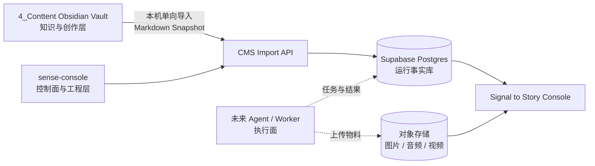

# 内容系统分层与 Obsidian 单向同步 SPEC

> 2026-10-06 决策更新：在线创作以平台云端存储为主，Obsidian 为独立可选本地形式。本文原有的 Obsidian 主编辑及必经导入流程属于历史方案；最新范围以 [云端内容 MVP](../plan/cloud-content-mvp.md) 为准。


> [!abstract] 决策摘要
> `4_Conttent/` 固定为 **知识与创作层**。工程代码统一放在私有仓库 `signal-to-story/sense-console/`；Supabase Postgres 保存运行状态、关系与审计，对象存储保存媒体二进制。Worker 在真实长任务出现后再建立，不属于当前框架阶段。
>
> Obsidian 到 CMS 是单向导入：本地同步器将明确授权的 Markdown 文档提交为可追溯快照；CMS 不反向静默改写 Vault 中的正文或 Properties。

相关文档：[[READMD]] · [[Signal-to-Story总体架构-SPEC]] · [[内容创作与AI-CMS指导-SPEC]] · [[PRD/AI内容生产系统-PRD-v1]]

---

## 1. 分层架构与职责



| 层 | 权威内容 | 存放位置 | 主要使用者 |
| --- | --- | --- | --- |
| 知识与创作层 | 研究、观点、正文、脚本、创作过程、复盘洞察 | 当前 Obsidian Vault 的 `4_Conttent/` | 创作者、Codex/Claude（经人工授权） |
| 控制与工程层 | Web Console、数据库 migration、契约、测试和部署配置 | `signal-to-story/sense-console/` | 创作者、开发者、CI/CD |
| 运行状态层 | 工作流状态、关系、审计、任务和指标 | Supabase Postgres | Console、同步器、未来 Agent/Worker |
| 素材层 | 图片、音频、视频、字幕和工程产物 | Supabase Storage、OSS、S3、R2 或受控本地目录 | Console、未来 Worker |

> [!warning] 不建立第二个“GitHub 笔记真相源”
> 本 Vault 不与工程仓库混用。若未来确有 Markdown 版本备份需求，可单独创建经过严格 `.gitignore` 的私有知识库备份仓库；它不承载 CMS 代码、密钥或生产视频素材。

---

## 2. 当前目录的固定边界

`4_Conttent/` 中允许的内容：

- Markdown 原稿、研究笔记、选题、Brief、脚本、分镜说明和复盘。
- Prompt 的创作说明、品牌规范、模板、JSON Schema 的**人类可读规范**。
- 素材索引、版权说明、引用链接、`asset_id`、缩略图或少量临时参考图。

不允许长期存放：

- CMS、同步器、Worker 的应用源码、`node_modules`、Docker 镜像或数据库 migration。
- `.env`、Supabase 高权限密钥、Provider API Key、登录 Token、用户数据导出。
- 可再生成的大型图片、音频、视频、成片和 Provider 下载缓存。

生产二进制文件在对象存储保存；本目录只记录其身份和用途。建议在内容文档中引用：

```yaml
asset_ids:
  - ast_01JX8K7...
cms_url: https://cms.example.com/content/cnt_01JX8K7...
```

---

## 3. 工程仓库的当前骨架

当前不建立 Monorepo、独立 Worker 或 `packages/`。Web、Supabase 工程配置和同步契约先统一放在 `sense-console/` 中：

```text
signal-to-story/
├── sense-console/
│   ├── src/
│   │   └── contracts/       # 当前 Web 使用的 Import、Proposal 等版本化 Schema
│   ├── supabase/
│   │   ├── migrations/      # 数据库结构、RLS、GRANT 和 Storage Policy
│   │   └── functions/       # 必要的短请求、Webhook 和受控导入接口
│   ├── docs/
│   │   └── supabase-data-model.md
│   ├── .env.example
│   └── package.json
├── docs-site/
└── README.md
```

`sense-console/src/contracts/` 先作为版本化契约位置。只有 Web、本机同步器和未来 Worker 确实需要共享构建产物时，才提升为 `sense-console/packages/contracts/`。

本机同步器仍必须在 Vault 所在设备运行，但本 SPEC 只定义其协议；具体工程入口在实现时根据真实使用方式确定，不提前创建空 Worker 或 CLI 工程。

---

## 4. 单向导入的对象、字段归属与前提

### 4.1 可导入文档

只有 Frontmatter 包含 `sync: true` 的文档进入同步候选集。默认不同步，防止私人笔记、未完成想法和无关资料泄露到 CMS。

```yaml
---
schema_version: 1
content_id: cnt_01JX8K7...
doc_type: content_draft # research | topic_brief | content_draft | script | storyboard | retrospective
sync: true
title: AI Agent 落地失败的三个真实原因
topic_id: top_01JX6A...
pillar: P2
tags:
  - AI Agent
---
```

| 字段类别 | 权威源 | 导入行为 |
| --- | --- | --- |
| `content_id`、`doc_type`、`title`、正文、标签、研究引用 | Obsidian | 每次成功导入后更新快照 |
| `topic_id` | CMS 创建后回填到模板或在首次导入时绑定 | 仅作关联，不能改变 Topic 的运营状态 |
| 评分、负责人、审核、排期、发布状态 | CMS | 导入器不得覆盖 |
| 媒体任务、素材、费用、发布实例、指标 | CMS + Storage | 不写入 Markdown；可在文档中人工引用 ID/链接 |

`content_id` 是永久身份。文件改名、移动目录、改标题均不得新建 ID；缺失 ID 的文件不能自动进入正式同步。

### 4.2 文档类型的导入结果

| `doc_type` | CMS 中的结果 |
| --- | --- |
| `research` | 创建可检索参考快照；不自动创建生产任务 |
| `topic_brief` | 创建或更新候选 Topic，初始状态为 `candidate` |
| `content_draft` | 关联已有 Topic，创建或更新 Content Project 的母稿快照 |
| `script` | 作为 Content Project 的脚本版本，可触发分镜审核 |
| `storyboard` | 转为待审核 Video Plan/镜头清单；不能直接创建付费任务 |
| `retrospective` | 关联发布实例，写入复盘草案，待人工确认 |

---

## 5. 本机同步器：组件与运行方式

同步器必须运行在本机，因为云端 CMS 无权读取 iCloud Vault。V1 推荐先做 CLI，V1.5 再做 Obsidian 插件界面。

```text
contentctl sync vault \
  --root "/path/to/Obsidian/4_Conttent" \
  --scope production
```

同步器由五个模块组成：

1. **Scanner**：扫描配置目录，筛选 `sync: true` 的 `.md` 文件。
2. **Parser & Validator**：解析 Frontmatter，按 `schema_version` 校验 ID、类型、必填字段和关联关系。
3. **Differ**：标准化换行与正文后计算 `SHA-256`；只发送新增或 Hash 变化的文档。
4. **Outbox**：将待发批次和幂等键保存在本机应用数据目录；网络失败可安全重试。
5. **API Client**：向 CMS 导入 API 发送批次，记录每个文档的接受、跳过或拒绝原因。

> [!tip] 触发策略
> V1 使用手动命令或 CMS 中的“导入本机 Vault”动作；V1.5 在保存后 10–30 秒防抖同步，并保留每小时全量扫描。iCloud 的文件事件可能丢失，因此不能只依赖文件监听。

---

## 6. 导入协议与服务端处理

### 6.1 请求契约（示意）

```json
{
  "vault_id": "vault_personal_content",
  "run_id": "sync_01JX...",
  "client_version": "0.1.0",
  "documents": [
    {
      "content_id": "cnt_01JX8K7...",
      "doc_type": "content_draft",
      "relative_path": "50.内容生产/40.初稿/AI-Agent-失败原因.md",
      "title": "AI Agent 落地失败的三个真实原因",
      "frontmatter": { "schema_version": 1, "sync": true },
      "markdown": "# AI Agent 落地失败……",
      "content_hash": "sha256:...",
      "modified_at": "2026-08-21T10:30:00+08:00"
    }
  ]
}
```

只上传相对路径，不能上传本机绝对路径、Vault 外文件或任何密钥文件。

### 6.2 服务端算法

```text
接收批次
  → 鉴权：调用者属于目标 workspace / vault
  → 校验 Schema、文档大小、doc_type、ID 唯一性
  → 对每篇文档以 content_id + content_hash 去重
  → 写入 source_import_runs 审计记录
  → 新增 source_documents 或写入 source_document_revisions
  → 更新最新快照、relative_path、last_imported_at
  → 创建或关联 Content Project；不覆盖其 CMS 工作流字段
  → 投递全文检索 / Embedding 异步任务
  → 返回逐文件结果
```

建议的结果枚举：`accepted`、`unchanged`、`rejected_validation`、`rejected_duplicate_id`、`needs_manual_link`、`failed_retryable`。

### 6.3 最小数据模型

| 表 | 作用 | 关键字段 |
| --- | --- | --- |
| `vaults` | 已授权的本地 Vault 注册信息 | `id, workspace_id, name, sync_root_hint` |
| `source_import_runs` | 导入批次审计与重试 | `id, vault_id, idempotency_key, status, started_at` |
| `source_documents` | 最新的 Obsidian 快照 | `id, content_id, vault_id, doc_type, relative_path, current_hash, markdown` |
| `source_document_revisions` | 不可变导入历史 | `id, source_document_id, hash, markdown, imported_at` |
| `content_projects` | CMS 生产容器 | `id, source_document_id, topic_id, workflow_status, owner_id` |
| `sync_issues` | 校验、关联、冲突和人工处理事项 | `id, import_run_id, content_id, issue_type, resolution` |

Markdown 可作为最新快照和不可变版本存入 Postgres，以支持 CMS 预览、全文检索和 Agent Context Pack；但它是**副本**，Vault 中的文件仍是正文主编辑端。

---

## 7. 版本、删除和冲突规则

| 场景 | 系统行为 |
| --- | --- |
| 文件改名/移动 | 由不变的 `content_id` 识别为同一文档，仅更新 `relative_path` |
| 正文修改 | Hash 变化，创建新 `source_document_revision` |
| Hash 未变化 | 返回 `unchanged`，不写新版本 |
| YAML 不合法/缺 ID | 拒绝该文件并建立 `sync_issue`，其他文件继续导入 |
| 同一 `content_id` 出现在两个文件 | 全部拒绝，必须人工消除重复 |
| 本地文件删除 | 标记 `missing_in_vault`，不自动删除 CMS、发布记录或素材 |
| 已发布版本后本地继续改稿 | 标记 `source_newer_than_published`，人工决定是否开启新生产轮次 |
| CMS 中的 AI/编辑改写 | 只保存为 `proposal` 或 CMS revision；不得覆写 Obsidian 文件 |

这不是“双向冲突同步”，因此不需要也不允许 CMS 自动合并正文。CMS 中有价值的 AI 改写由你人工复制回 Obsidian，或在未来明确设计“导出建议文件”后再处理。

---

## 8. 认证、权限与安全边界

- 本机同步器通过 CMS 登录获得用户会话；Refresh Token 仅存系统 Keychain 或受保护的本机应用目录。
- 浏览器、本机 CLI、Obsidian 文件中都不保存 `service_role`、数据库密码或 Provider Key。
- 导入 API 验证用户、`workspace_id` 与 `vault_id` 的对应关系；服务端才拥有受控写入能力。
- Postgres 公开 Schema 的表必须启用 RLS；`TO authenticated` 不是资源所有权校验，策略仍需绑定 `workspace_id`/`owner_id`。[RLS 指南](https://supabase.com/docs/guides/database/postgres/row-level-security)
- 导入 API 做大小限制、速率限制、Schema 白名单与审计；不接受任意路径、任意 SQL 或任意二进制文件。
- 媒体文件使用私有对象存储；Console 通过短期签名 URL 展示。未来 Worker 负责把 Provider 临时文件复制到自有 Storage/OSS，并回写资产元数据和关系。

---

## 9. 实施顺序与验收

### V1：先证明单条链路

1. 在 `signal-to-story/sense-console` 建立 `src/contracts/`、`supabase/` 和数据模型文档位置。
2. 定义 `ObsidianImportDocument` Schema 与 `content_id` 生成规则。
3. 创建 `source_documents`、`source_document_revisions`、`source_import_runs`、`sync_issues` migration 和 RLS。
4. 实现 CMS Import API 与最小内容详情页。
5. 实现 `contentctl sync vault --dry-run`，先只报告可导入/错误，不写库。
6. 实现真实导入、幂等重试、本地 outbox 与逐文件报告。
7. 用 5 篇真实 Markdown 验证改名、改稿、校验失败、删除和已发布后修改的规则。

### V1 验收条件

- 一篇含 `sync: true` 的 Obsidian 初稿可在 CMS 中显示标题、正文快照、来源路径、Hash 和导入历史。
- 重复运行不产生重复 Content Project 或重复 revision。
- 修改正文后只新增一个可追溯 revision。
- CMS 改变审核/发布状态后，再次导入不会被 Markdown 覆盖。
- 缺失 ID、重复 ID、非法 Frontmatter 都有可读错误，且不损坏已导入内容。
- 本机、Git 仓库、浏览器包和 Markdown 中均没有高权限密钥。

---

## 10. 本阶段不做

- 不做 Obsidian ↔ CMS 全文双向同步。
- 不把整个 iCloud Vault 推送至 GitHub。
- 不让 Agent 直接写数据库、批准内容或发布。
- 不将生成视频、源视频或渲染缓存提交到 Git。
- 不在同步器中实现媒体生成、转码或发布；这些属于后续独立 Worker 与 Console 工作流。
- 当前不创建 Monorepo、`packages/` 或 Media Worker；满足真实共享或长任务条件后再引入。

> [!success] 本 SPEC 的完成定义
> 任意一篇进入生产的 Markdown 内容，都能用稳定 `content_id` 在 CMS 找到对应快照、导入历史、工作流和素材；但无论 CMS、Agent 或 Worker 如何运行，都不会未经确认改写你的 Obsidian 原稿。
